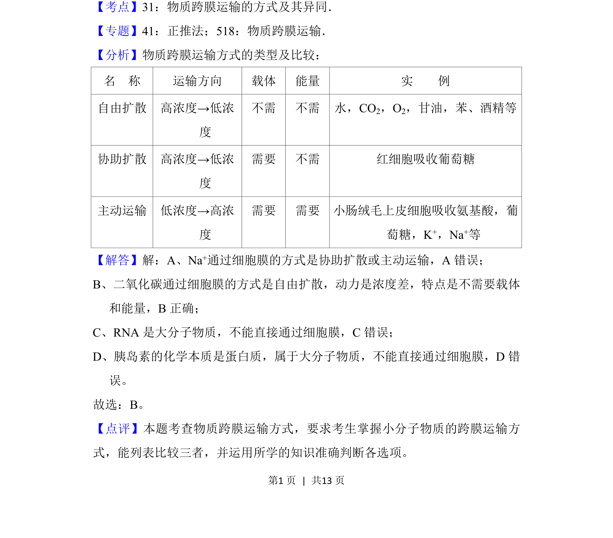

## 题面

## 摘要

该题考查物质跨膜运输方式，要求判断以自由扩散通过细胞膜的物质。

## 关联考点

- [[635-物质跨膜运输|物质跨膜运输]]
- [[261-自由扩散|自由扩散]]
- [[细胞膜选择透过性]]

## 答案与解析

> 📄 原 PDF 第 1 页：`素材/真题/北京/2008-2024·（北京）生物高考真题/2018年高考生物试卷（北京）（解析卷）.pdf`

<!-- 题干文本-start -->
## 题干文本
1． （6分）细胞膜的选择透过性保证了细胞内相对稳定的微环境。下列物质中，
以（自由）扩散方式通过细胞膜的是（　　）
A．Na+ B．二氧化碳C．RNA D．胰岛素
<!-- 题干文本-end -->

<!-- 解析文本-start -->
## 解析文本
【考点】31：物质跨膜运输的方式及其异同．菁优网版权所有
【专题】41：正推法；518：物质跨膜运输．
【分析】物质跨膜运输方式的类型及比较：
名　称 运输方向 载体 能量 实　　例
自由扩散 高浓度→低浓
度
不需 不需 水，CO2，O2，甘油，苯、酒精等
协助扩散 高浓度→低浓
度
需要 不需 红细胞吸收葡萄糖
主动运输 低浓度→高浓
度
需要 需要 小肠绒毛上皮细胞吸收氨基酸，葡
萄糖，K+，Na+等
【解答】解：A、Na+通过细胞膜的方式是协助扩散或主动运输，A错误；
B、二氧化碳通过细胞膜的方式是自由扩散，动力是浓度差，特点是不需要载体
和能量，B正确；
C、RNA是大分子物质，不能直接通过细胞膜，C错误；
D、胰岛素的化学本质是蛋白质，属于大分子物质，不能直接通过细胞膜，D错
误。
故选：B。
【点评】本题考查物质跨膜运输方式，要求考生掌握小分子物质的跨膜运输方
式，能列表比较三者，并运用所学的知识准确判断各选项。
<!-- 解析文本-end -->
