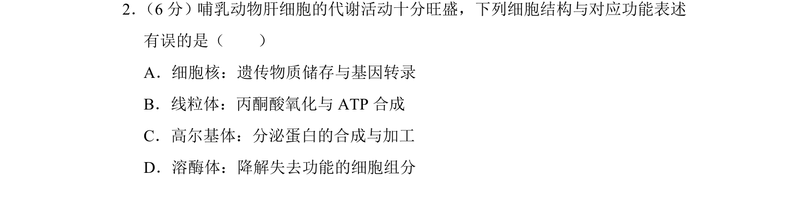
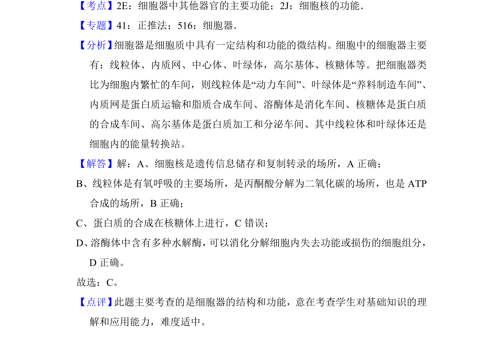

## 题面

## 摘要

考查哺乳动物肝细胞中细胞核、线粒体、高尔基体、溶酶体的结构与功能对应关系

## 关联考点

- [[细胞核功能]]
- [[883-线粒体功能|线粒体功能]]
- [[高尔基体功能]]
- [[溶酶体功能]]

## 答案与解析

> 📄 原 PDF 第 2 页：`素材/真题/北京/2008-2024·（北京）生物高考真题/2018年高考生物试卷（北京）（解析卷）.pdf`
