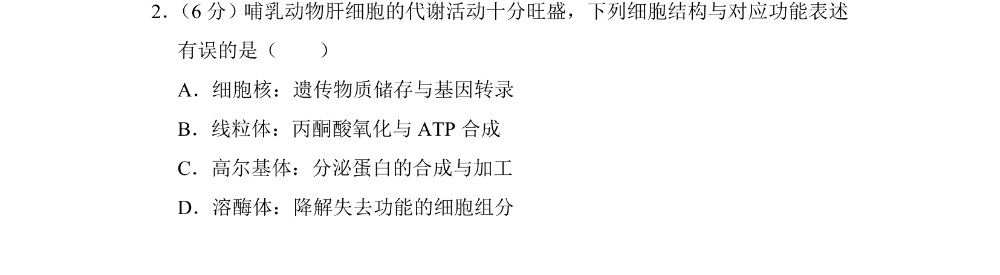
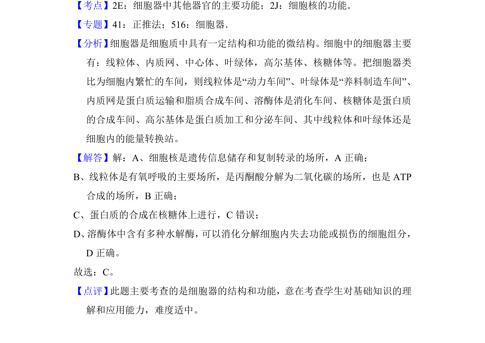

## 题面

## 摘要

考查哺乳动物肝细胞中细胞核、线粒体、高尔基体、溶酶体的结构与功能对应关系

## 关联考点

- [[细胞核功能]]
- [[883-线粒体功能|线粒体功能]]
- [[高尔基体功能]]
- [[溶酶体功能]]

## 答案与解析

> 📄 原 PDF 第 2 页：`素材/真题/北京/2008-2024·（北京）生物高考真题/2018年高考生物试卷（北京）（解析卷）.pdf`

<!-- 题干文本-start -->
## 题干文本
2． （6分）哺乳动物肝细胞的代谢活动十分旺盛，下列细胞结构与对应功能表述
有误的是（　　）
A．细胞核：遗传物质储存与基因转录
B．线粒体：丙酮酸氧化与ATP合成
C．高尔基体：分泌蛋白的合成与加工
D．溶酶体：降解失去功能的细胞组分
<!-- 题干文本-end -->

<!-- 解析文本-start -->
## 解析文本
【考点】2E：细胞器中其他器官的主要功能；2J：细胞核的功能．菁优网版权所有
【专题】41：正推法；516：细胞器．
【分析】 细胞器是细胞质中具有一定结构和功能的微结构。细胞中的细胞器主要
有：线粒体、内质网、中心体、叶绿体，高尔基体、核糖体等。把细胞器类
比为细胞内繁忙的车间，则线粒体是“动力车间”、叶绿体是“养料制造车间”、
内质网是蛋白质运输和脂质合成车间、溶酶体是消化车间、核糖体是蛋白质
的合成车间、高尔基体是蛋白质加工和分泌车间、其中线粒体和叶绿体还是
细胞内的能量转换站。
【解答】解：A、细胞核是遗传信息储存和复制转录的场所，A正确；
B、线粒体是有氧呼吸的主要场所，是丙酮酸分解为二氧化碳的场所，也是ATP
合成的场所，B正确；
C、蛋白质的合成在核糖体上进行，C错误；
D、 溶酶体中含有多种水解酶， 可以消化分解细胞内失去功能或损伤的细胞组分，
D正确。
故选：C。
【点评】 此题主要考查的是细胞器的结构和功能，意在考查学生对基础知识的理
解和应用能力，难度适中。
<!-- 解析文本-end -->
