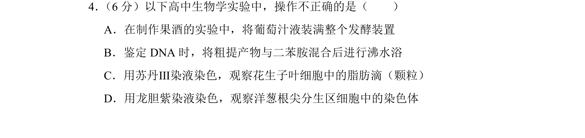
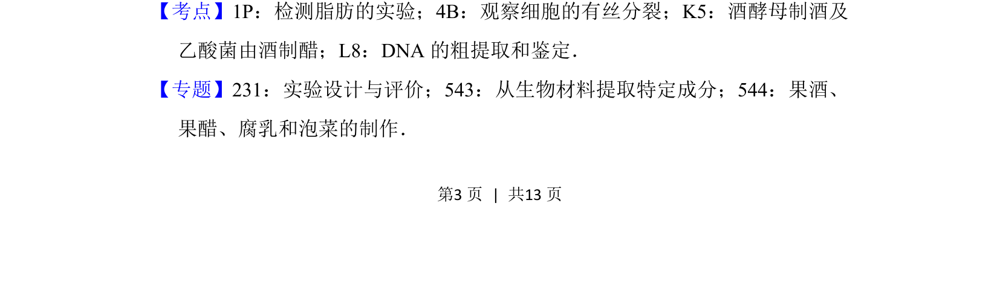
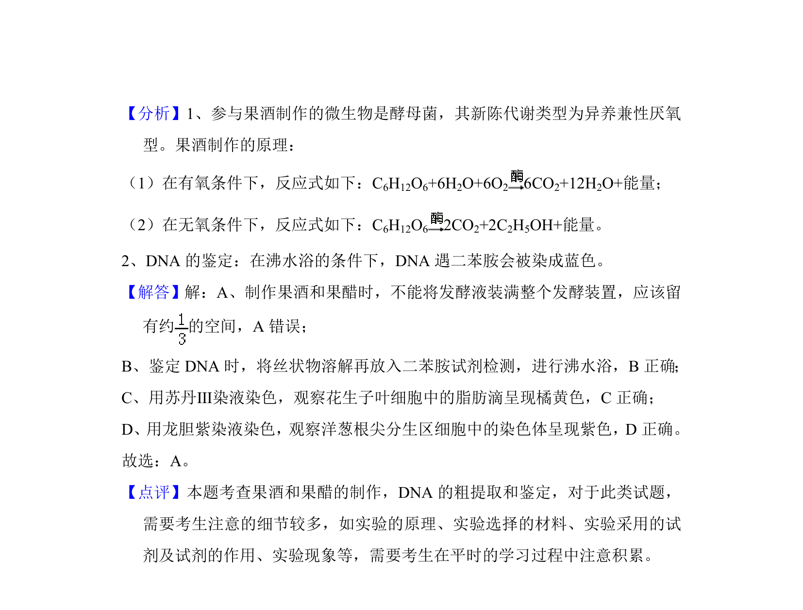

## 题面

## 摘要

该题考查高中生物实验中果酒制作、DNA鉴定、脂肪检测和观察有丝分裂的操作正误判断。

## 关联考点

- [[893-果酒制作|果酒制作]]
- [[DNA的粗提取和鉴定]]
- [[检测脂肪的实验]]
- [[902-观察细胞的有丝分裂|观察细胞的有丝分裂]]

## 答案与解析

> 📄 原 PDF 第 3 页：`素材/真题/北京/2008-2024·（北京）生物高考真题/2018年高考生物试卷（北京）（解析卷）.pdf`
