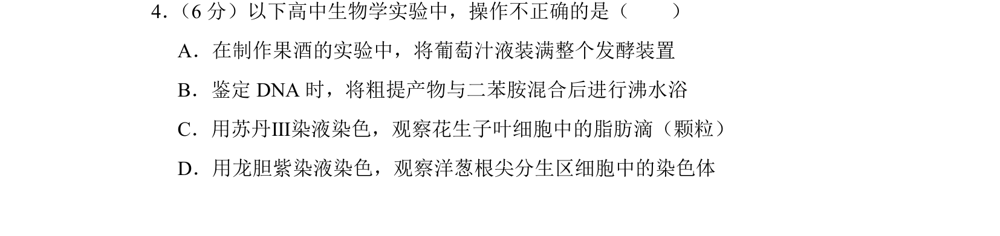
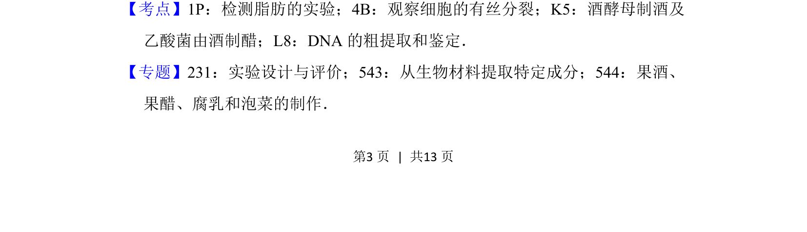
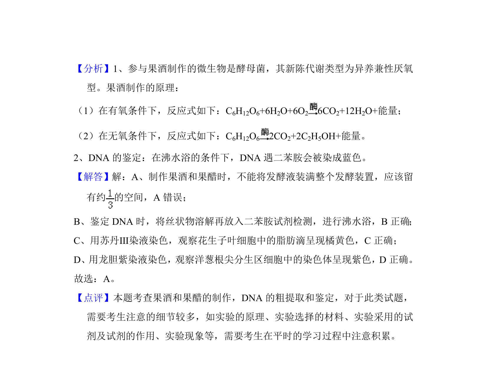

## 题面

## 摘要

该题考查高中生物实验中果酒制作、DNA鉴定、脂肪检测和观察有丝分裂的操作正误判断。

## 关联考点

- [[893-果酒制作|果酒制作]]
- [[DNA的粗提取和鉴定]]
- [[检测脂肪的实验]]
- [[902-观察细胞的有丝分裂|观察细胞的有丝分裂]]

## 答案与解析

> 📄 原 PDF 第 3 页：`素材/真题/北京/2008-2024·（北京）生物高考真题/2018年高考生物试卷（北京）（解析卷）.pdf`

<!-- 题干文本-start -->
## 题干文本
4． （6分）以下高中生物学实验中，操作不正确的是（　　）
A．在制作果酒的实验中，将葡萄汁液装满整个发酵装置
B．鉴定DNA时，将粗提产物与二苯胺混合后进行沸水浴
C．用苏丹Ⅲ染液染色，观察花生子叶细胞中的脂肪滴（颗粒）
D．用龙胆紫染液染色，观察洋葱根尖分生区细胞中的染色体
<!-- 题干文本-end -->

<!-- 解析文本-start -->
## 解析文本
【考点】1P：检测脂肪的实验；4B：观察细胞的有丝分裂；K5：酒酵母制酒及
乙酸菌由酒制醋；L8：DNA的粗提取和鉴定．菁优网版权所有
【专题】231：实验设计与评价；543：从生物材料提取特定成分；544：果酒、
果醋、腐乳和泡菜的制作．
<!-- 解析文本-end -->
