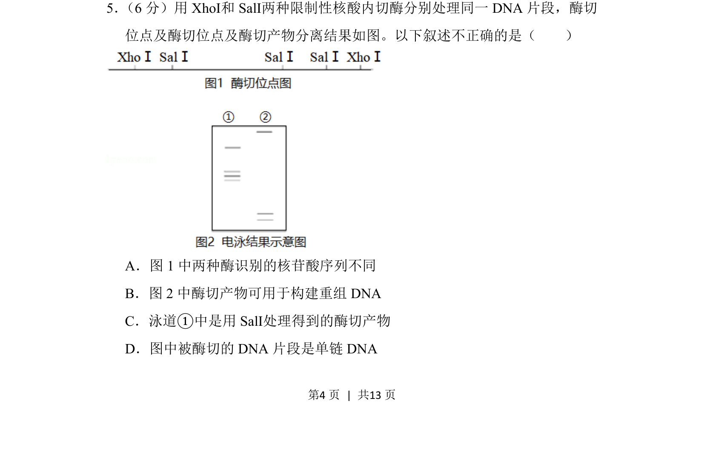
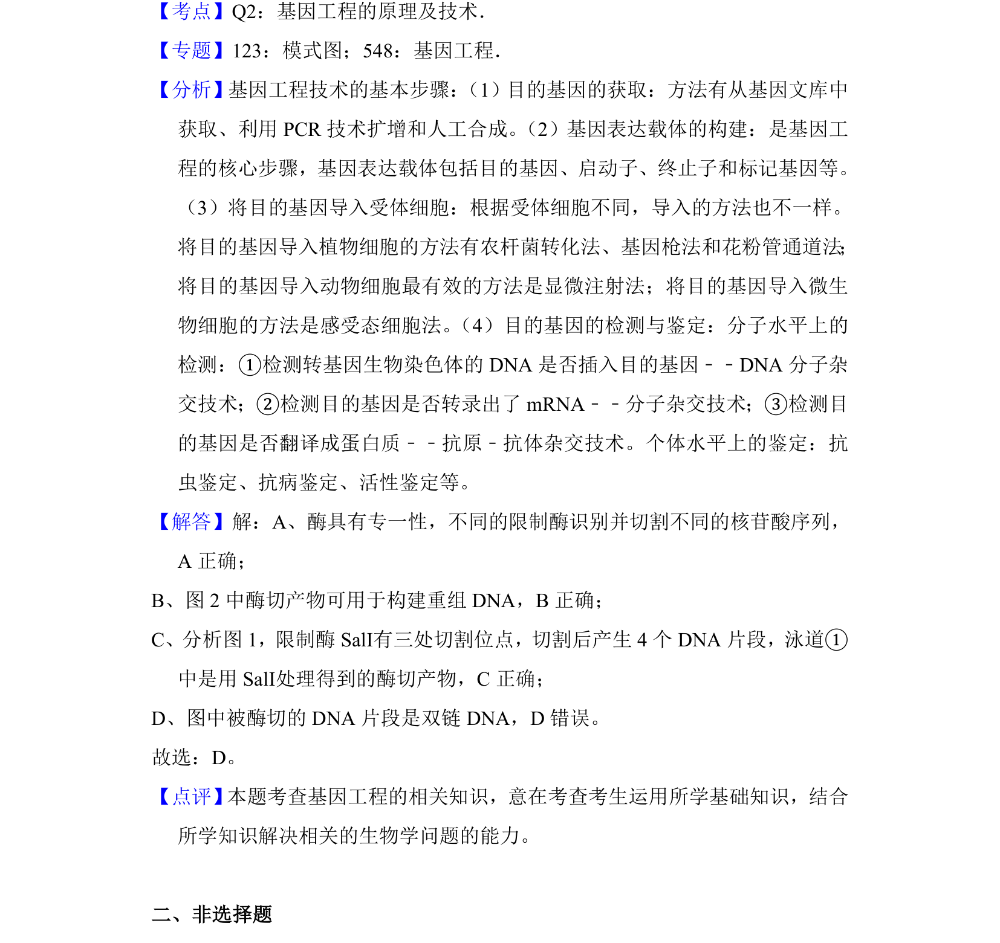

## 题面

## 摘要

限制酶酶切位点识别、酶切产物电泳结果分析及DNA结构判断

## 关联考点

- [[422-限制性核酸内切酶|限制性核酸内切酶]]
- [[DNA电泳]]
- [[重组DNA构建]]
- [[DNA单双链结构]]

## 答案与解析

> 📄 原 PDF 第 4 页：`素材/真题/北京/2008-2024·（北京）生物高考真题/2018年高考生物试卷（北京）（解析卷）.pdf`
