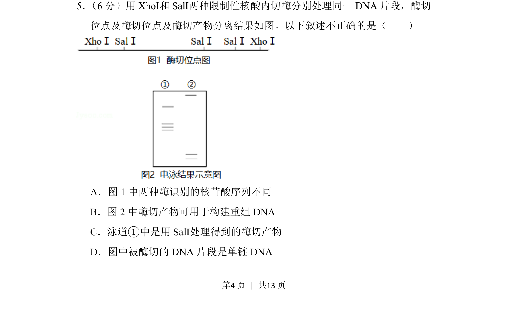
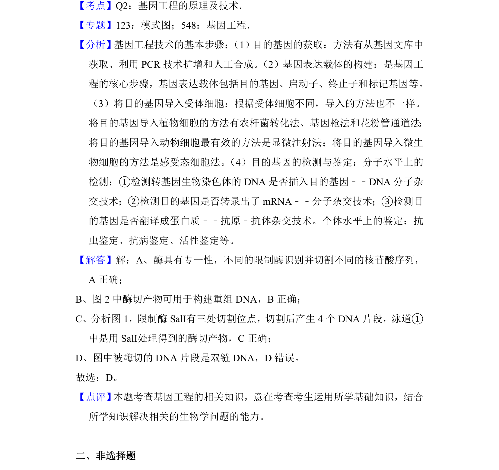

## 题面

## 摘要

限制酶酶切位点识别、酶切产物电泳结果分析及DNA结构判断

## 关联考点

- [[422-限制性核酸内切酶|限制性核酸内切酶]]
- [[DNA电泳]]
- [[重组DNA构建]]
- [[DNA单双链结构]]

## 答案与解析

> 📄 原 PDF 第 4 页：`素材/真题/北京/2008-2024·（北京）生物高考真题/2018年高考生物试卷（北京）（解析卷）.pdf`

<!-- 题干文本-start -->
## 题干文本
5． （6分）用XhoⅠ和SalⅠ两种限制性核酸内切酶分别处理同一DNA片段，酶切
位点及酶切位点及酶切产物分离结果如图。以下叙述不正确的是（　　）
A．图1中两种酶识别的核苷酸序列不同
B．图2中酶切产物可用于构建重组DNA
C．泳道①中是用SalⅠ处理得到的酶切产物
D．图中被酶切的DNA片段是单链DNA
<!-- 题干文本-end -->

<!-- 解析文本-start -->
## 解析文本

<!-- 解析文本-end -->
