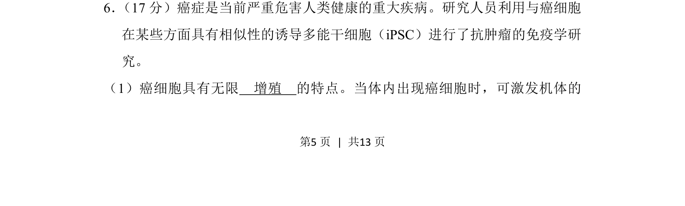
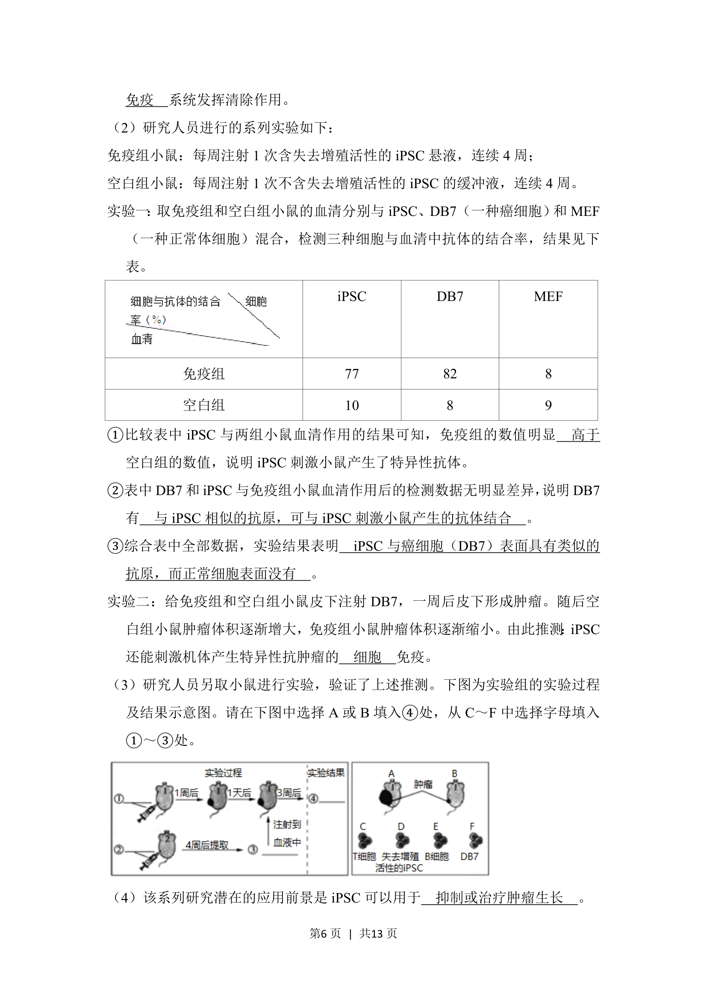
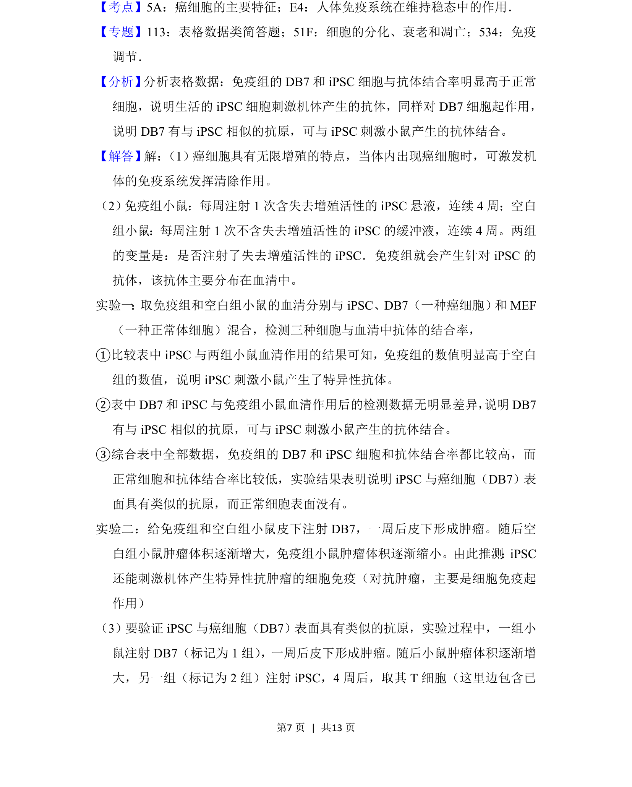
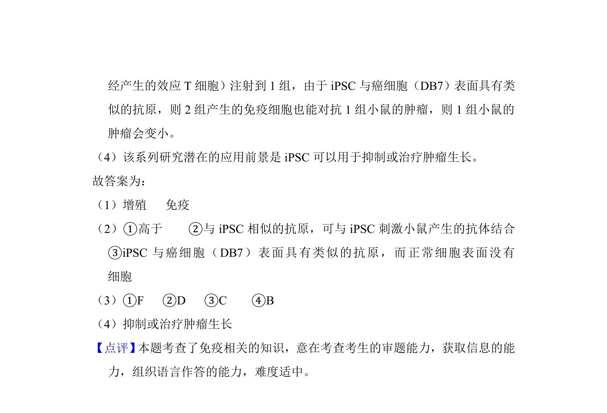

## 题面

## 摘要

考查癌细胞特征及免疫学相关知识，涉及癌细胞无限增殖特性与免疫应答机制。

## 关联考点

- [[815-癌细胞特征|癌细胞特征]]
- [[584-增殖|细胞增殖]]
- [[免疫系统功能]]
- [[免疫应答]]

## 答案与解析

> 📄 原 PDF 第 5 页：`素材/真题/北京/2008-2024·（北京）生物高考真题/2018年高考生物试卷（北京）（解析卷）.pdf`
