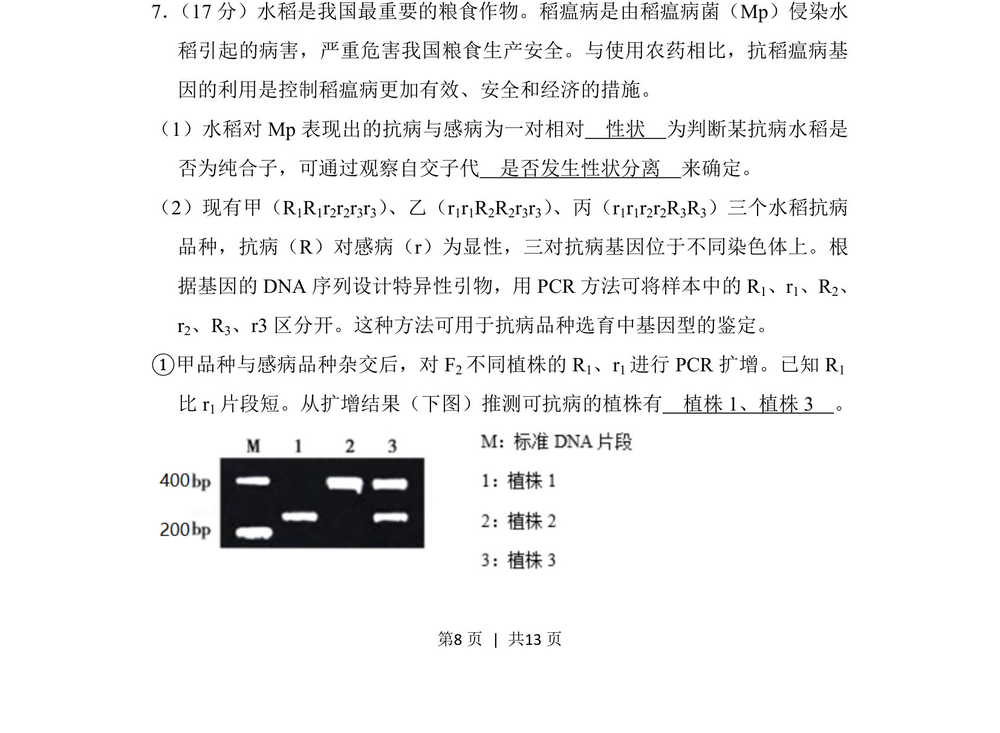
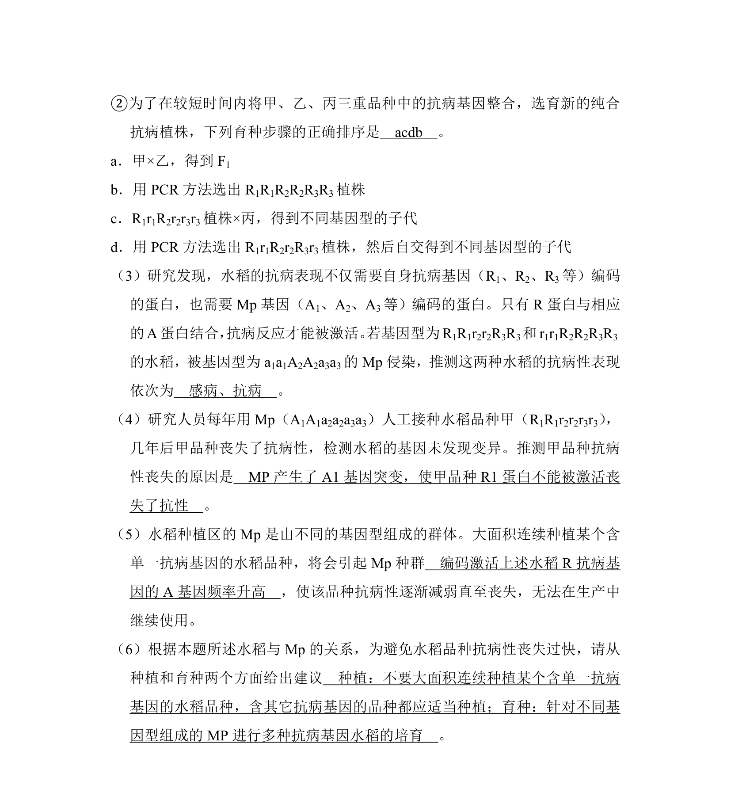
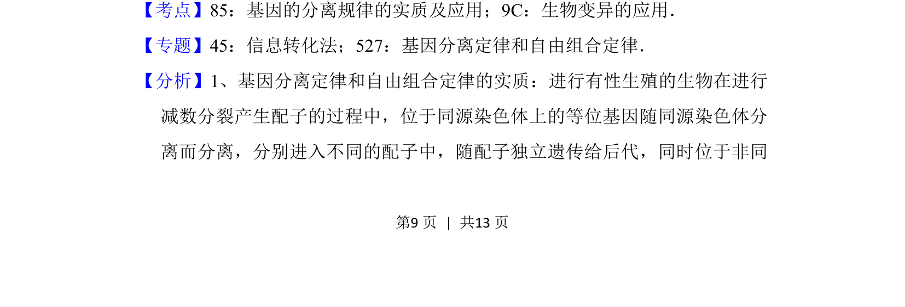
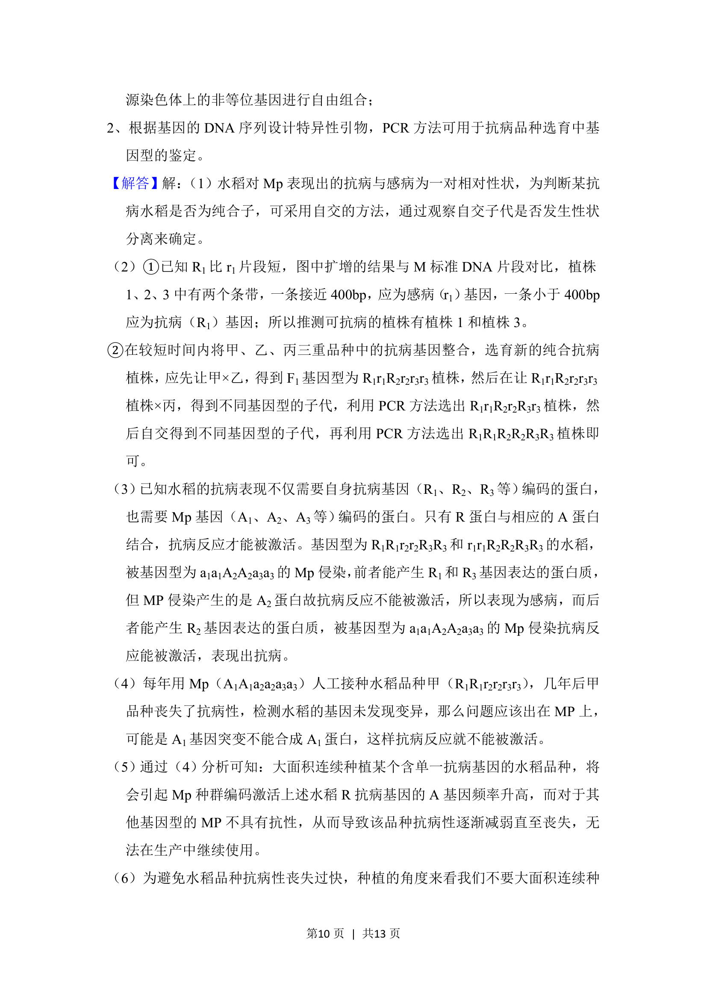
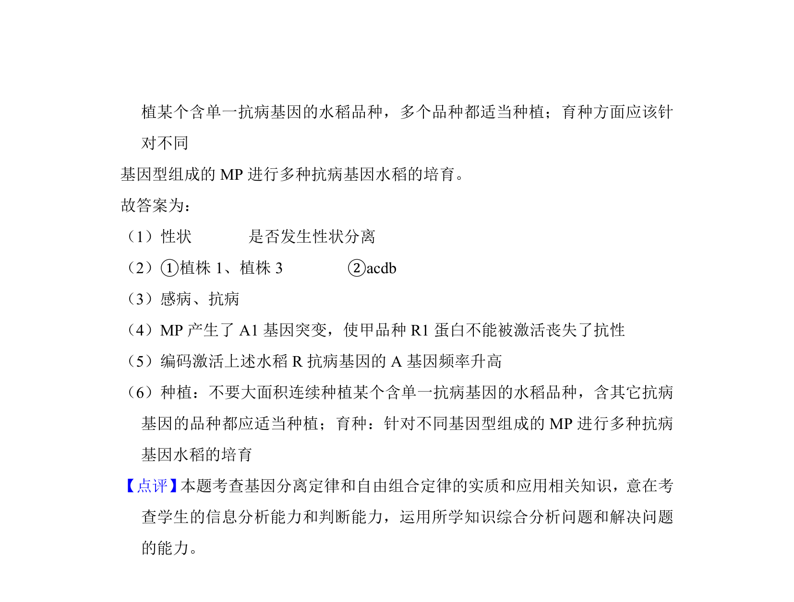

## 题面

## 摘要

考查水稻抗病性状的遗传规律，结合PCR技术鉴定抗病基因型。

## 关联考点

- [[910-相对性状|相对性状]]
- [[纯合子鉴定]]
- [[827-PCR技术|PCR技术]]
- [[基因型分析]]

## 答案与解析

> 📄 原 PDF 第 8 页：`素材/真题/北京/2008-2024·（北京）生物高考真题/2018年高考生物试卷（北京）（解析卷）.pdf`
