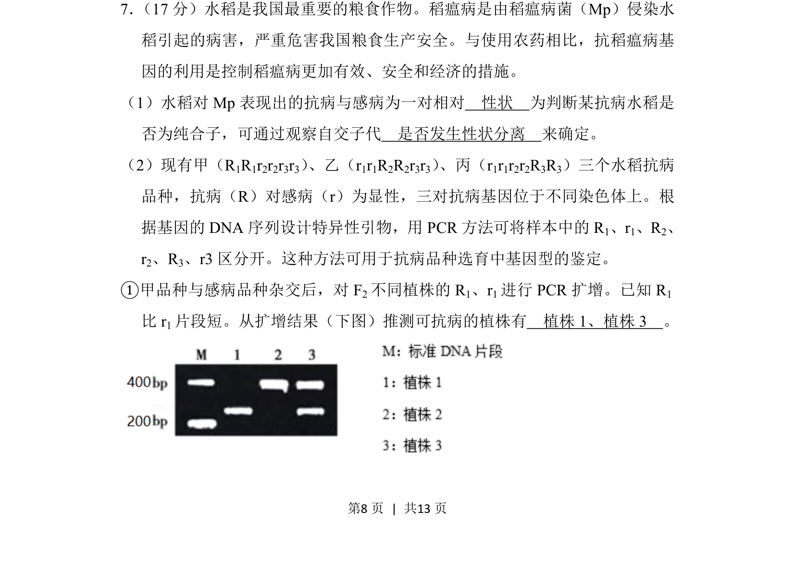
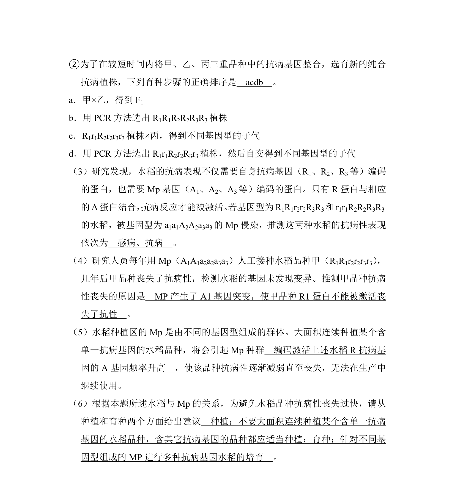
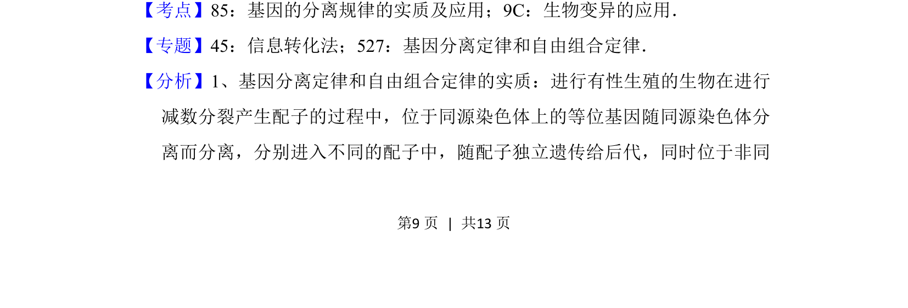
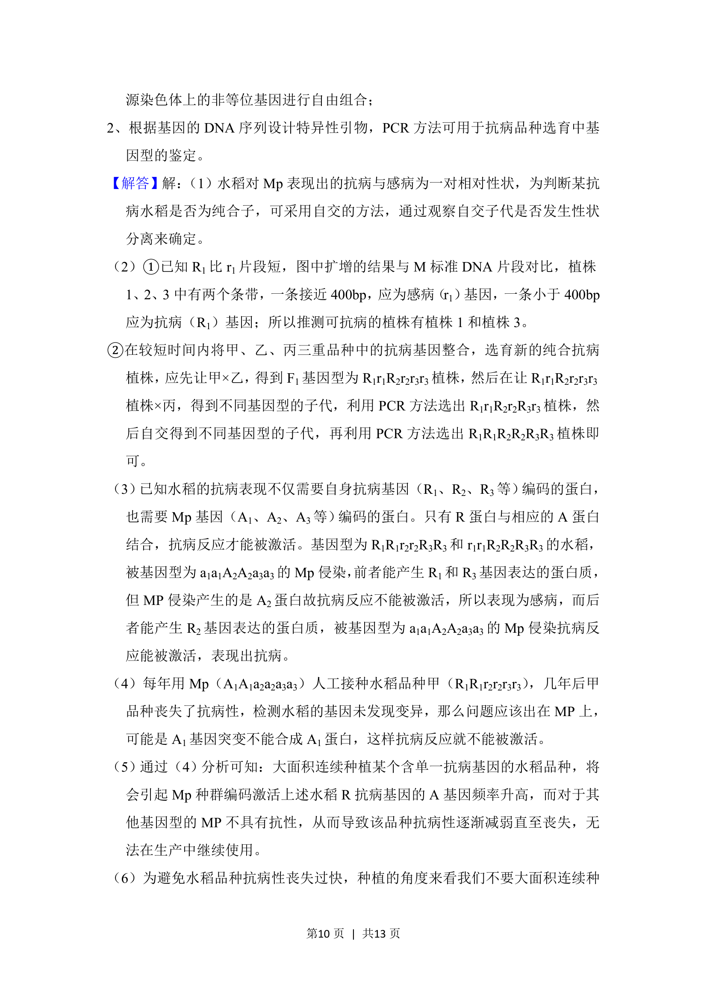
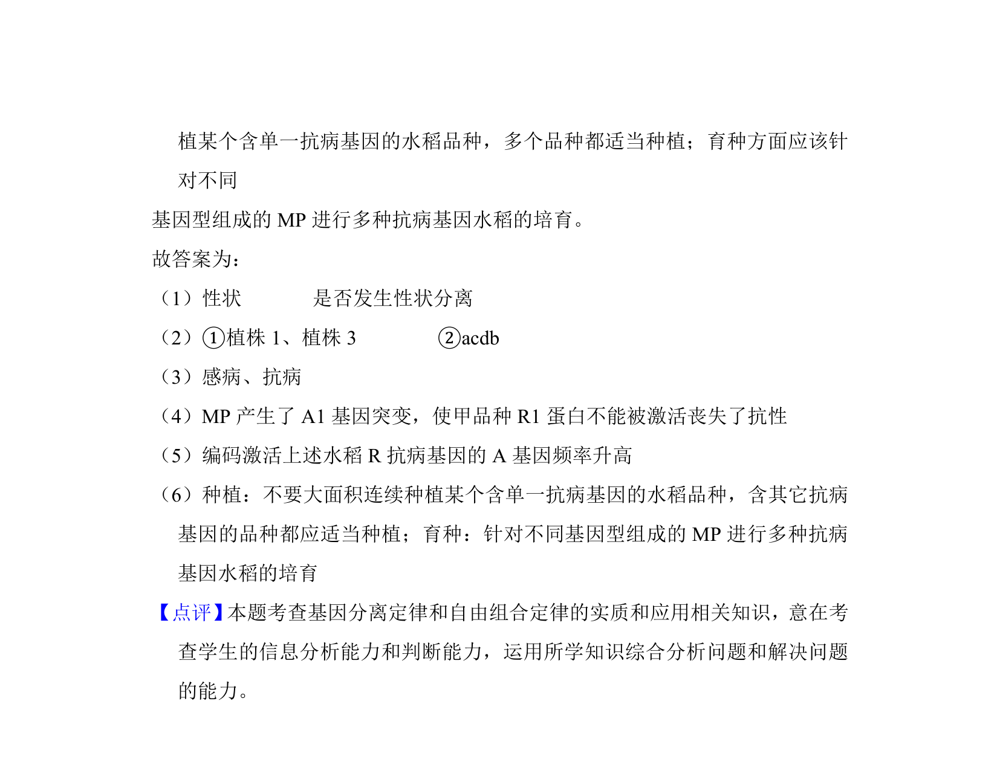

## 题面

## 摘要

考查水稻抗病性状的遗传规律，结合PCR技术鉴定抗病基因型。

## 关联考点

- [[910-相对性状|相对性状]]
- [[纯合子鉴定]]
- [[827-PCR技术|PCR技术]]
- [[基因型分析]]

## 答案与解析

> 📄 原 PDF 第 8 页：`素材/真题/北京/2008-2024·（北京）生物高考真题/2018年高考生物试卷（北京）（解析卷）.pdf`

<!-- 题干文本-start -->
## 题干文本
7． （17分）水稻是我国最重要的粮食作物。稻瘟病是由稻瘟病菌（Mp）侵染水
稻引起的病害，严重危害我国粮食生产安全。与使用农药相比，抗稻瘟病基
因的利用是控制稻瘟病更加有效、安全和经济的措施。
（1）水稻对Mp表现出的抗病与感病为一对相对　性状　为判断某抗病水稻是
否为纯合子，可通过观察自交子代　是否发生性状分离　来确定。
（2）现有甲（R1R1r2r2r3r3） 、乙（r1r1R2R2r3r3） 、丙（r1r1r2r2R3R3）三个水稻抗病
品种，抗病（R）对感病（r）为显性，三对抗病基因位于不同染色体上。根
据基因的DNA序列设计特异性引物，用PCR方法可将样本中的R 1、r1、R2、
r2、R3、r3区分开。这种方法可用于抗病品种选育中基因型的鉴定。
①甲品种与感病品种杂交后，对F 2不同植株的R 1、r1进行PCR扩增。已知R 1
比r 1片段短。从扩增结果（下图）推测可抗病的植株有　植株1、植株3　。
<!-- 题干文本-end -->

<!-- 解析文本-start -->
## 解析文本

<!-- 解析文本-end -->
