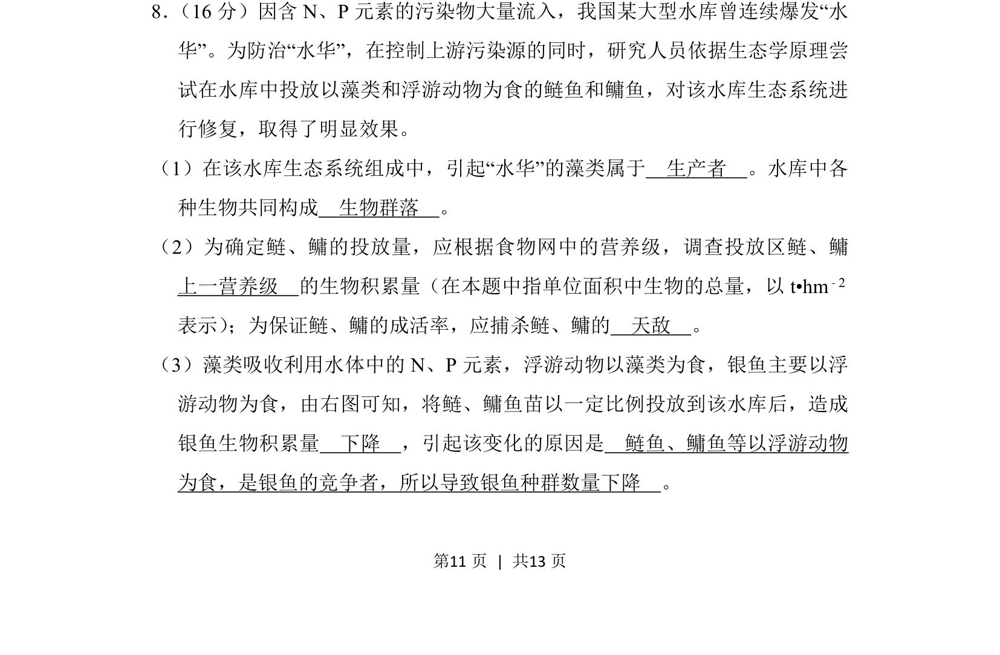
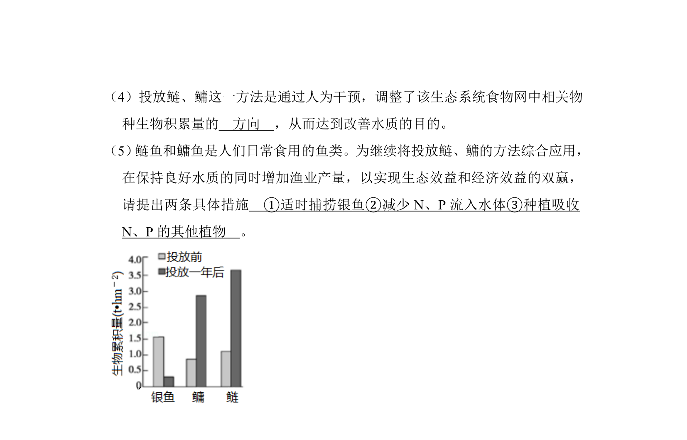
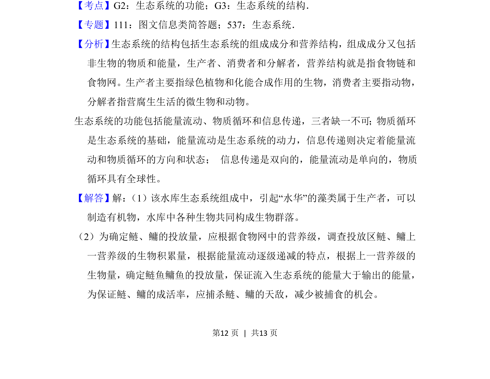
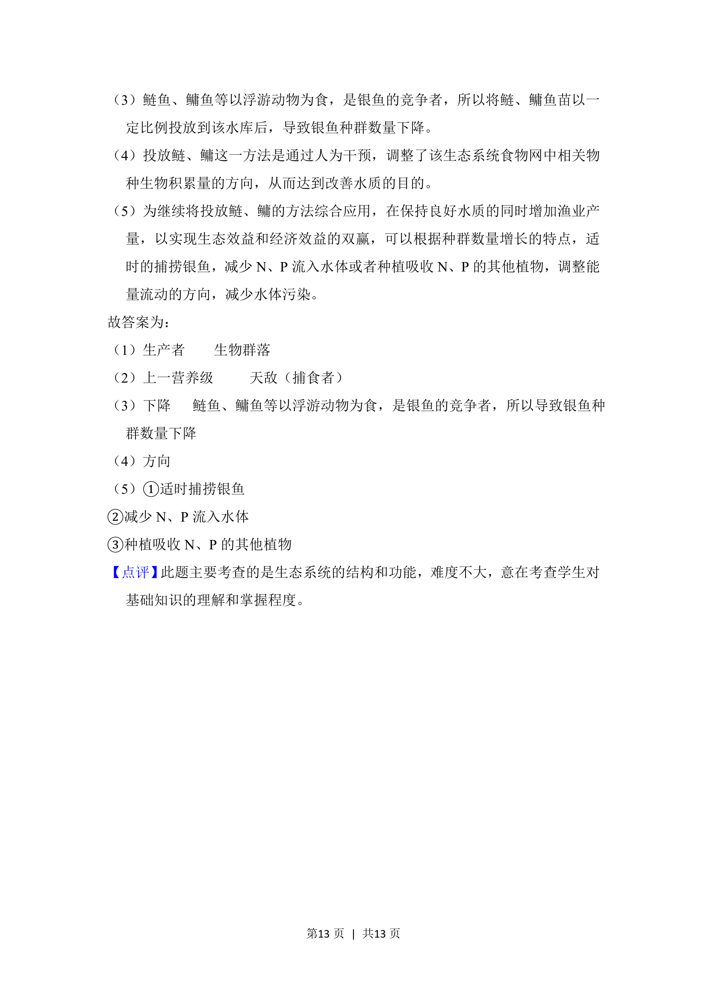

## 题面

## 摘要

该题以水库“水华”治理为情境，考查生态系统成分、生物群落、营养级及种间关系对种群数量的影响。

## 关联考点

- [[382-生产者|生产者]]
- [[374-群落|生物群落]]
- [[389-营养级|营养级]]
- [[667-种间竞争|种间竞争]]

## 答案与解析

> 📄 原 PDF 第 11 页：`素材/真题/北京/2008-2024·（北京）生物高考真题/2018年高考生物试卷（北京）（解析卷）.pdf`
