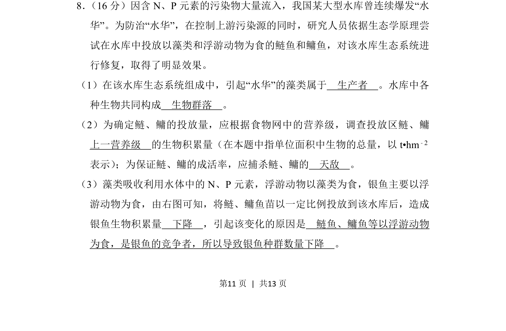
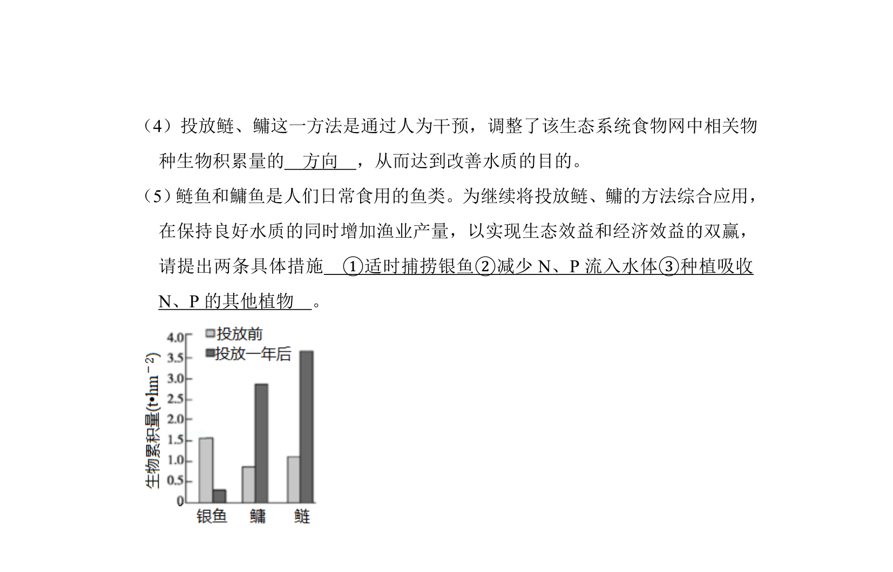
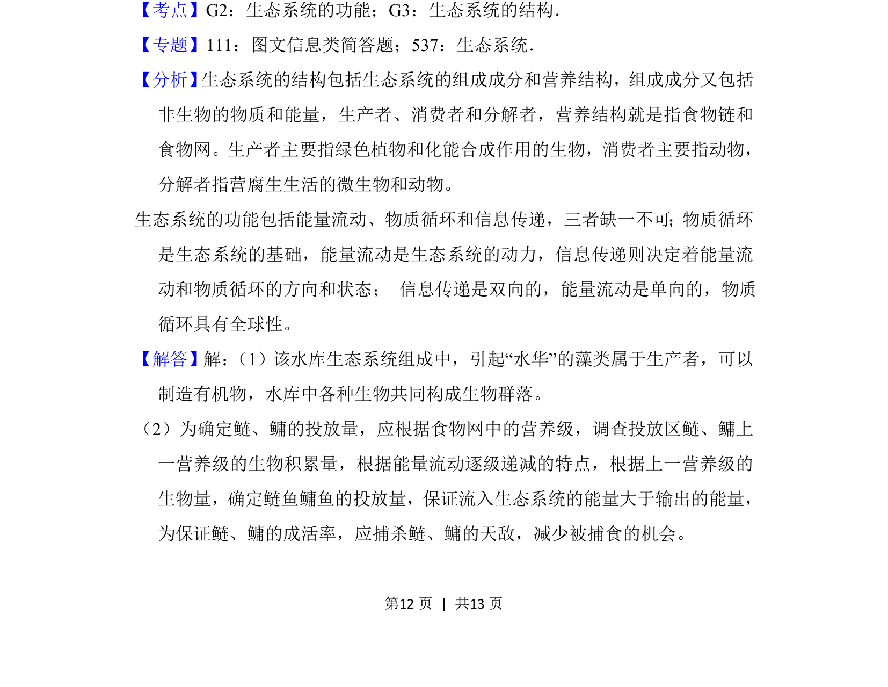
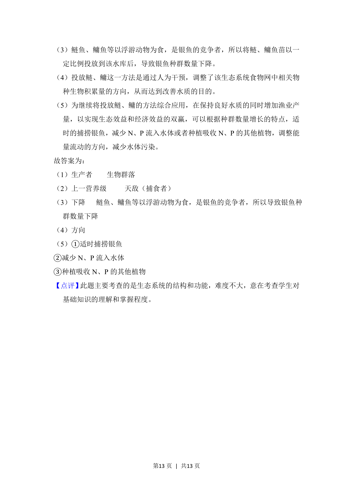

## 题面

## 摘要

该题以水库“水华”治理为情境，考查生态系统成分、生物群落、营养级及种间关系对种群数量的影响。

## 关联考点

- [[382-生产者|生产者]]
- [[374-群落|生物群落]]
- [[389-营养级|营养级]]
- [[667-种间竞争|种间竞争]]

## 答案与解析

> 📄 原 PDF 第 11 页：`素材/真题/北京/2008-2024·（北京）生物高考真题/2018年高考生物试卷（北京）（解析卷）.pdf`

<!-- 题干文本-start -->
## 题干文本
8． （16分）因含N、P元素的污染物大量流入，我国某大型水库曾连续爆发“水
华”。为防治“水华”，在控制上游污染源的同时，研究人员依据生态学原理尝
试在水库中投放以藻类和浮游动物为食的鲢鱼和鳙鱼，对该水库生态系统进
行修复，取得了明显效果。
（1）在该水库生态系统组成中，引起“水华”的藻类属于　生产者　。水库中各
种生物共同构成　生物群落　。
（2）为确定鲢、鳙的投放量，应根据食物网中的营养级，调查投放区鲢、鳙　
上一营养级　的生物积累量（在本题中指单位面积中生物的总量，以t•hm ﹣2
表示） ；为保证鲢、鳙的成活率，应捕杀鲢、鳙的　天敌　。
（3）藻类吸收利用水体中的N、P元素，浮游动物以藻类为食，银鱼主要以浮
游动物为食，由右图可知，将鲢、鳙鱼苗以一定比例投放到该水库后，造成
银鱼生物积累量　下降　，引起该变化的原因是　鲢鱼、鳙鱼等以浮游动物
为食，是银鱼的竞争者，所以导致银鱼种群数量下降　。
<!-- 题干文本-end -->

<!-- 解析文本-start -->
## 解析文本

<!-- 解析文本-end -->
