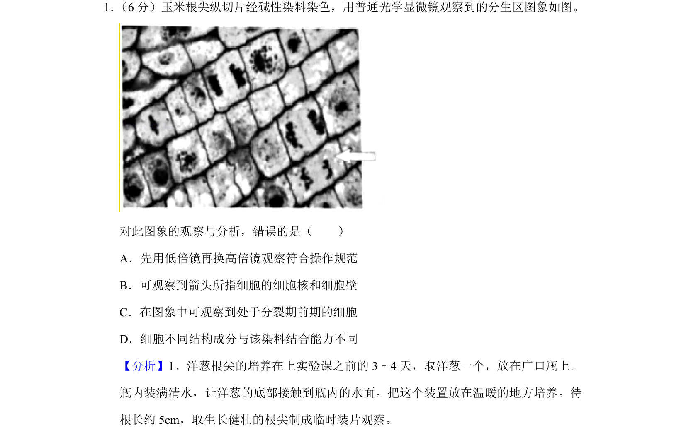

## 题面

## 摘要

观察植物根尖分生区细胞有丝分裂实验及显微镜操作

## 关联考点

- [[有丝分裂实验]]
- [[显微镜使用]]
- [[染色原理]]

## 答案与解析

> 📄 原 PDF 第 1 页：`素材/真题/北京/2008-2024·（北京）生物高考真题/2019年高考生物试卷（北京）（解析卷）.pdf`

<!-- 题干文本-start -->
## 题干文本
1． （6分）玉米根尖纵切片经碱性染料染色，用普通光学显微镜观察到的分生区图象如图。
对此图象的观察与分析，错误的是（　　）
A．先用低倍镜再换高倍镜观察符合操作规范
B．可观察到箭头所指细胞的细胞核和细胞壁
C．在图象中可观察到处于分裂期前期的细胞
D．细胞不同结构成分与该染料结合能力不同
<!-- 题干文本-end -->

<!-- 解析文本-start -->
## 解析文本
【分析】1、洋葱根尖的培养在上实验课之前的3﹣4天，取洋葱一个，放在广口瓶上。
瓶内装满清水，让洋葱的底部接触到瓶内的水面。把这个装置放在温暖的地方培养。待
根长约5cm，取生长健壮的根尖制成临时装片观察。
<!-- 解析文本-end -->
