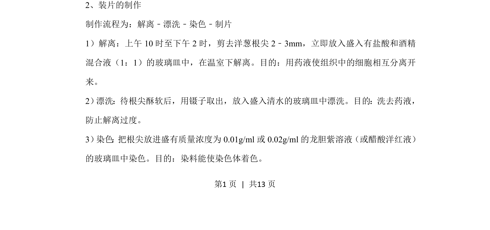
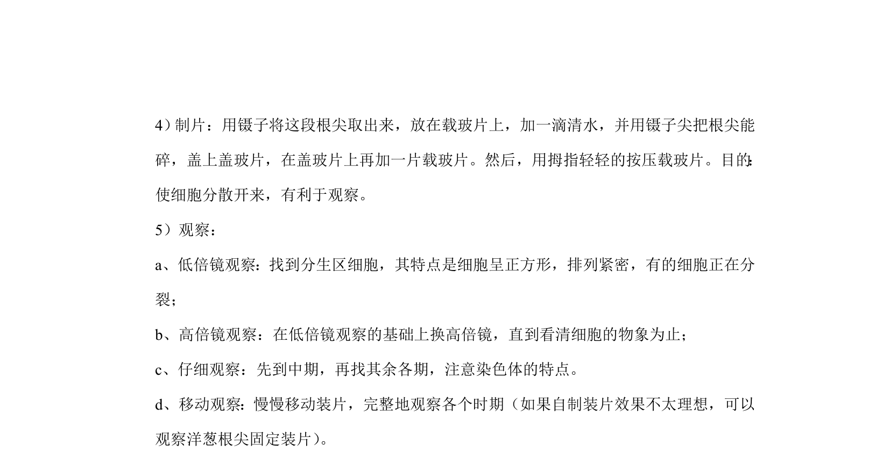
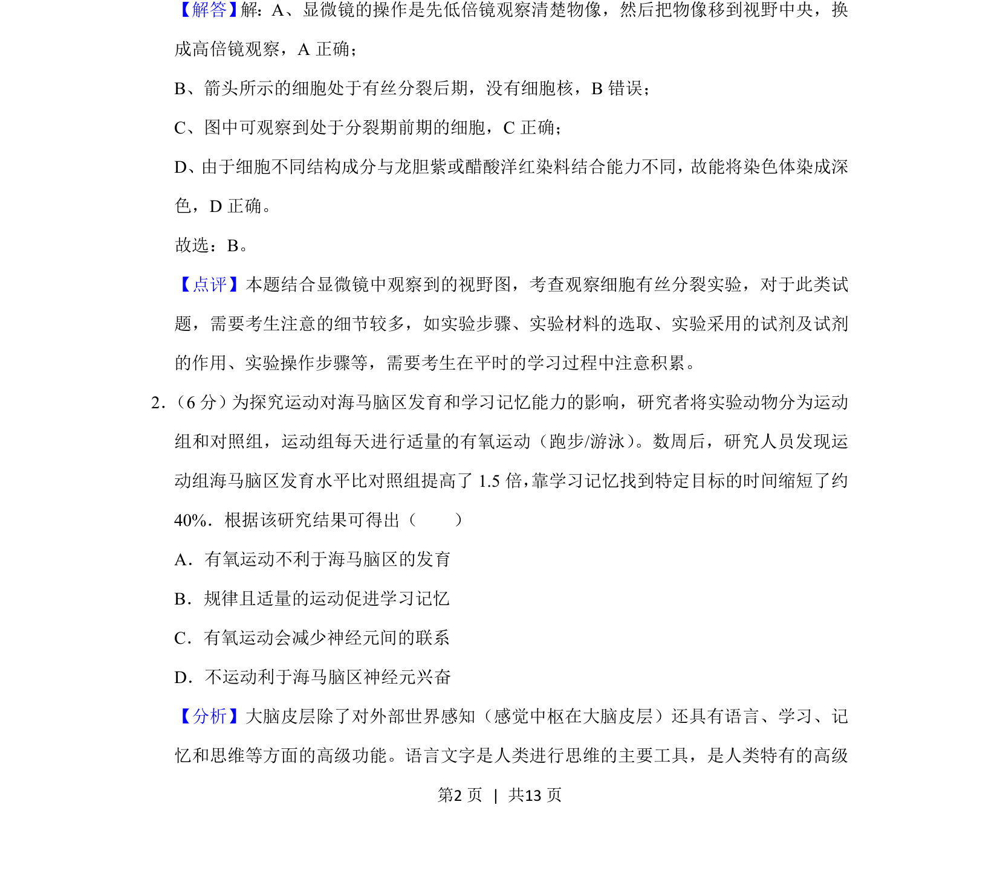
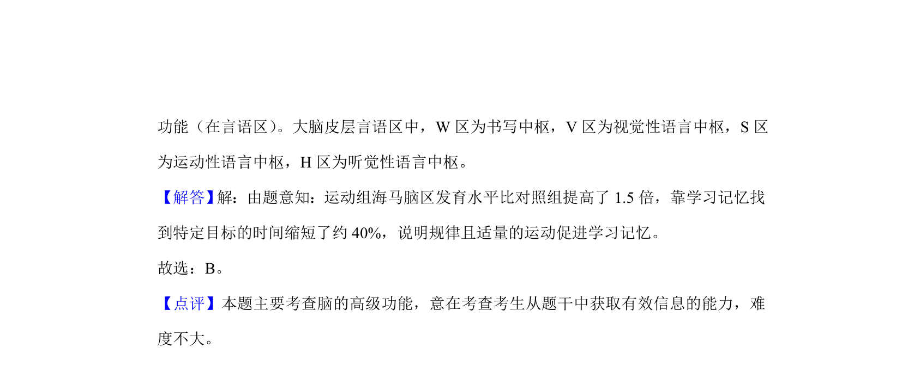

## 题面

## 摘要

观察洋葱根尖细胞有丝分裂的装片制作流程及步骤目的

## 关联考点

- [[901-观察植物细胞有丝分裂|观察植物细胞有丝分裂]]
- [[908-装片制作|装片制作]]
- [[903-解离|解离]]
- [[894-染色|染色]]

## 答案与解析

> 📄 原 PDF 第 1 页：`素材/真题/北京/2008-2024·（北京）生物高考真题/2019年高考生物试卷（北京）（解析卷）.pdf`

<!-- 题干文本-start -->
## 题干文本
2、装片的制作
制作流程为：解离﹣漂洗﹣染色﹣制片
1）解离：上午10时至下午2时，剪去洋葱根尖2﹣3mm，立即放入盛入有盐酸和酒精
混合液（1：1）的玻璃皿中，在温室下解离。目的：用药液使组织中的细胞相互分离开
来。
2） 漂洗：待根尖酥软后，用镊子取出，放入盛入清水的玻璃皿中漂洗。目的：洗去药液，
防止解离过度。
3） 染色 ： 把根尖放进盛有质量浓度为0.01g/ml或0.02g/ml的龙胆紫溶液（或醋酸洋红液）
的玻璃皿中染色。目的：染料能使染色体着色。
<!-- 题干文本-end -->

<!-- 解析文本-start -->
## 解析文本

<!-- 解析文本-end -->
