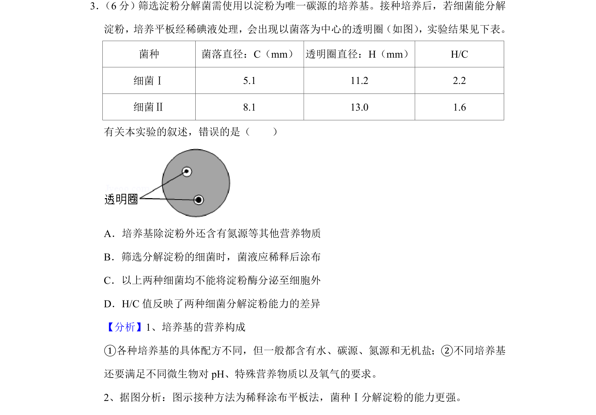
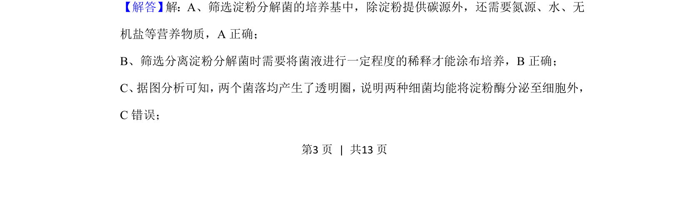
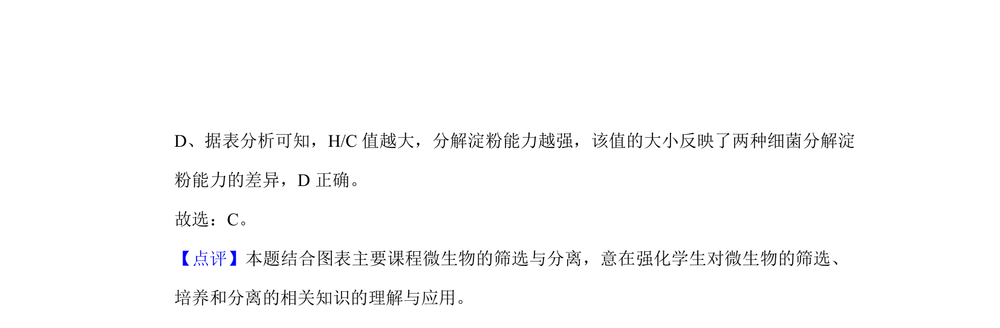

## 题面

## 摘要

本实验考查筛选淀粉分解菌的培养基条件、涂布方法及透明圈结果分析。

## 关联考点

- [[培养基营养构成]]
- [[755-稀释涂布平板法|稀释涂布平板法]]
- [[淀粉酶分泌]]
- [[H/C值]]

## 答案与解析

> 📄 原 PDF 第 3 页：`素材/真题/北京/2008-2024·（北京）生物高考真题/2019年高考生物试卷（北京）（解析卷）.pdf`
