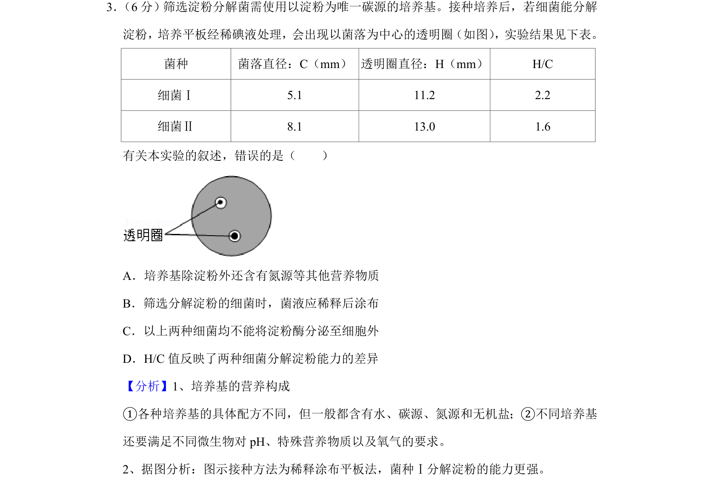
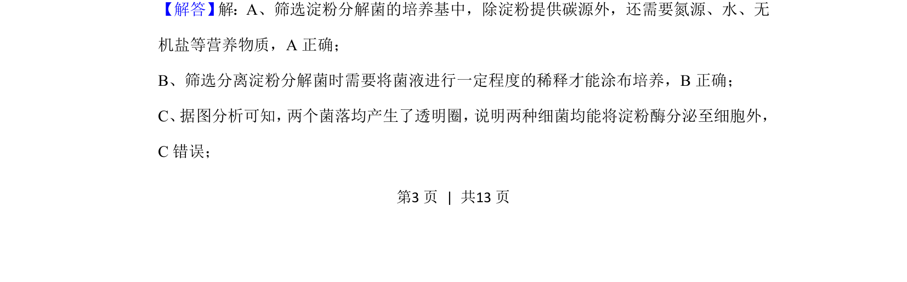
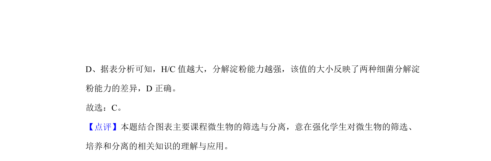

## 题面

## 摘要

本实验考查筛选淀粉分解菌的培养基条件、涂布方法及透明圈结果分析。

## 关联考点

- [[培养基营养构成]]
- [[755-稀释涂布平板法|稀释涂布平板法]]
- [[淀粉酶分泌]]
- [[H/C值]]

## 答案与解析

> 📄 原 PDF 第 3 页：`素材/真题/北京/2008-2024·（北京）生物高考真题/2019年高考生物试卷（北京）（解析卷）.pdf`

<!-- 题干文本-start -->
## 题干文本
3． （6分）筛选淀粉分解菌需使用以淀粉为唯一碳源的培养基。接种培养后，若细菌能分解
淀粉，培养平板经稀碘液处理，会出现以菌落为中心的透明圈（如图） ，实验结果见下表。
菌种 菌落直径：C（mm） 透明圈直径：H（mm） H/C
细菌Ⅰ 5.1 11.2 2.2
细菌Ⅱ 8.1 13.0 1.6
有关本实验的叙述，错误的是（　　）
A．培养基除淀粉外还含有氮源等其他营养物质
B．筛选分解淀粉的细菌时，菌液应稀释后涂布
C．以上两种细菌均不能将淀粉酶分泌至细胞外
D．H/C值反映了两种细菌分解淀粉能力的差异
<!-- 题干文本-end -->

<!-- 解析文本-start -->
## 解析文本
【分析】1、培养基的营养构成
①各种培养基的具体配方不同，但一般都含有水、碳源、氮源和无机盐；②不同培养基
还要满足不同微生物对pH、特殊营养物质以及氧气的要求。
2、据图分析：图示接种方法为稀释涂布平板法，菌种Ⅰ分解淀粉的能力更强。
【解答】 解：A、筛选淀粉分解菌的培养基中，除淀粉提供碳源外，还需要氮源、水、无
机盐等营养物质，A正确；
B、筛选分离淀粉分解菌时需要将菌液进行一定程度的稀释才能涂布培养，B正确；
C、 据图分析可知， 两个菌落均产生了透明圈， 说明两种细菌均能将淀粉酶分泌至细胞外，
C错误；
<!-- 解析文本-end -->
