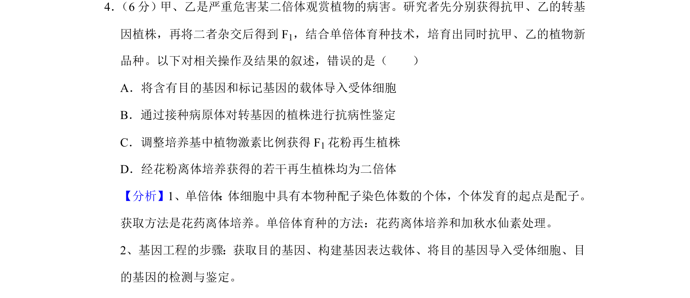
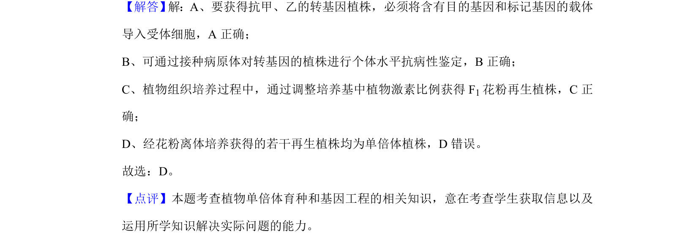

## 题面

## 摘要

单倍体育种与基因工程结合培育抗病新品种的操作分析

## 关联考点

- [[300-单倍体|单倍体育种]]
- [[411-基因工程|基因工程]]
- [[437-植物组织培养|植物组织培养]]
- [[抗病鉴定]]

## 答案与解析

> 📄 原 PDF 第 4 页：`素材/真题/北京/2008-2024·（北京）生物高考真题/2019年高考生物试卷（北京）（解析卷）.pdf`
