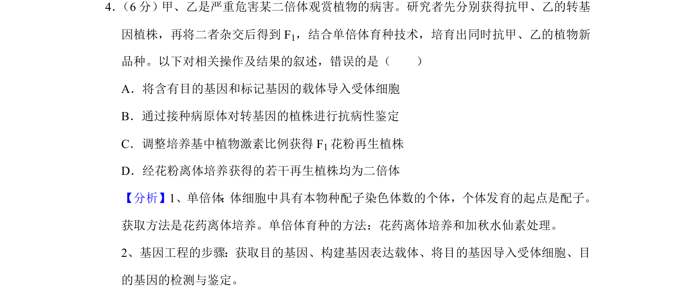
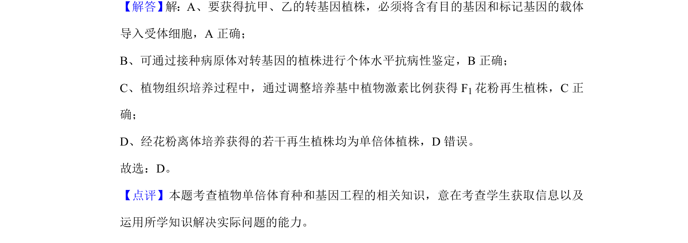

## 题面

## 摘要

单倍体育种与基因工程结合培育抗病新品种的操作分析

## 关联考点

- [[300-单倍体|单倍体育种]]
- [[411-基因工程|基因工程]]
- [[437-植物组织培养|植物组织培养]]
- [[抗病鉴定]]

## 答案与解析

> 📄 原 PDF 第 4 页：`素材/真题/北京/2008-2024·（北京）生物高考真题/2019年高考生物试卷（北京）（解析卷）.pdf`

<!-- 题干文本-start -->
## 题干文本
4． （6分）甲、乙是严重危害某二倍体观赏植物的病害。研究者先分别获得抗甲、乙的转基
因植株，再将二者杂交后得到F 1，结合单倍体育种技术，培育出同时抗甲、乙的植物新
品种。以下对相关操作及结果的叙述，错误的是（　　）
A．将含有目的基因和标记基因的载体导入受体细胞
B．通过接种病原体对转基因的植株进行抗病性鉴定
C．调整培养基中植物激素比例获得F 1花粉再生植株
D．经花粉离体培养获得的若干再生植株均为二倍体
<!-- 题干文本-end -->

<!-- 解析文本-start -->
## 解析文本
【分析】1、单倍体 ： 体细胞中具有本物种配子染色体数的个体，个体发育的起点是配子。
获取方法是花药离体培养。单倍体育种的方法：花药离体培养和加秋水仙素处理。
2、基因工程的步骤：获取目的基因、构建基因表达载体、将目的基因导入受体细胞、目
的基因的检测与鉴定。
【解答】 解：A、要获得抗甲、乙的转基因植株，必须将含有目的基因和标记基因的载体
导入受体细胞，A正确；
B、可通过接种病原体对转基因的植株进行个体水平抗病性鉴定，B正确；
C、植物组织培养过程中，通过调整培养基中植物激素比例获得F 1花粉再生植株，C正
确；
D、经花粉离体培养获得的若干再生植株均为单倍体植株，D错误。
故选：D。
【点评】本题考查植物单倍体育种和基因工程的相关知识，意在考查学生获取信息以及
运用所学知识解决实际问题的能力。
<!-- 解析文本-end -->
