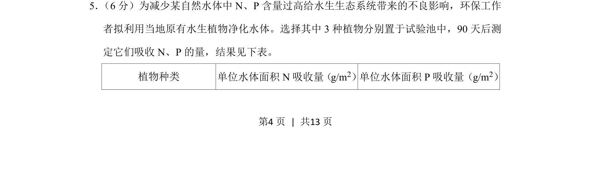
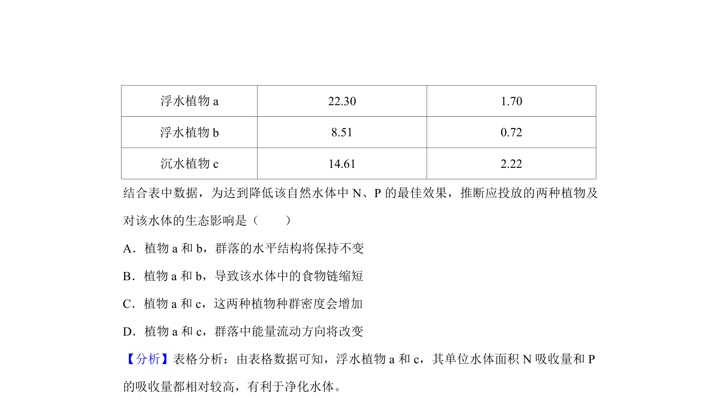
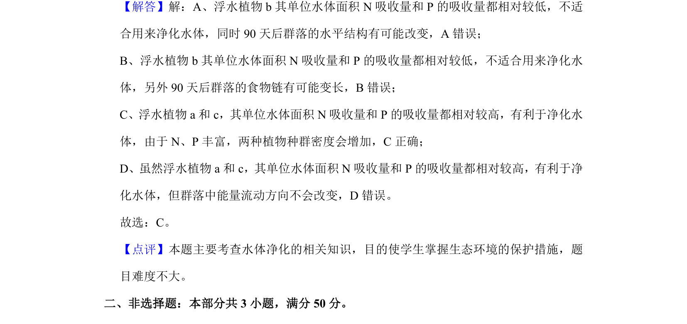

## 题面

## 摘要

通过表格数据分析3种水生植物对N、P的吸收量，评价水体净化效果。

## 关联考点

- [[水体富营养化]]
- [[398-生态修复|生态修复]]
- [[581-实验数据分析|实验数据分析]]

## 答案与解析

> 📄 原 PDF 第 4 页：`素材/真题/北京/2008-2024·（北京）生物高考真题/2019年高考生物试卷（北京）（解析卷）.pdf`
