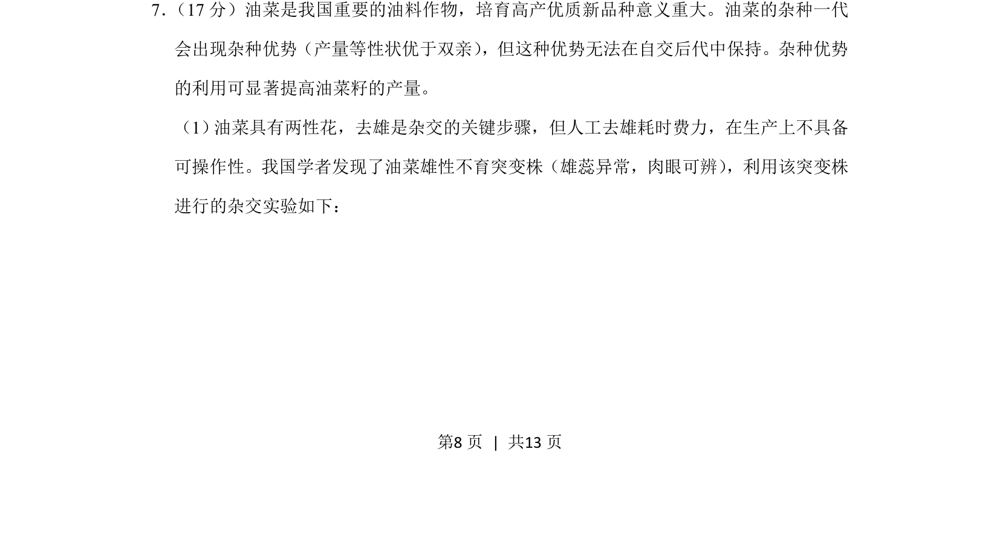
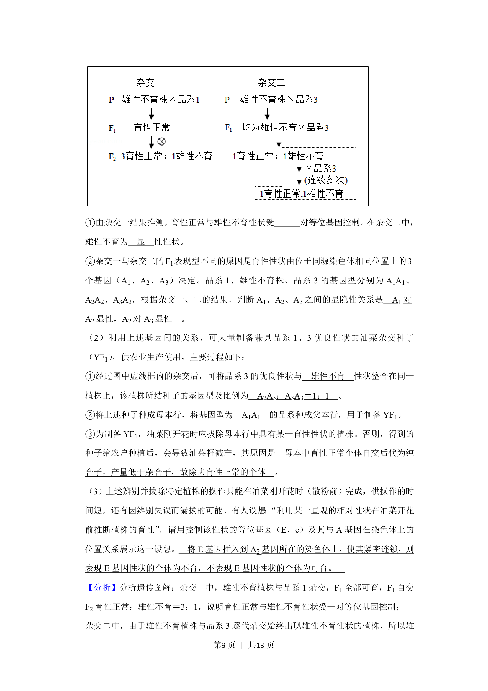
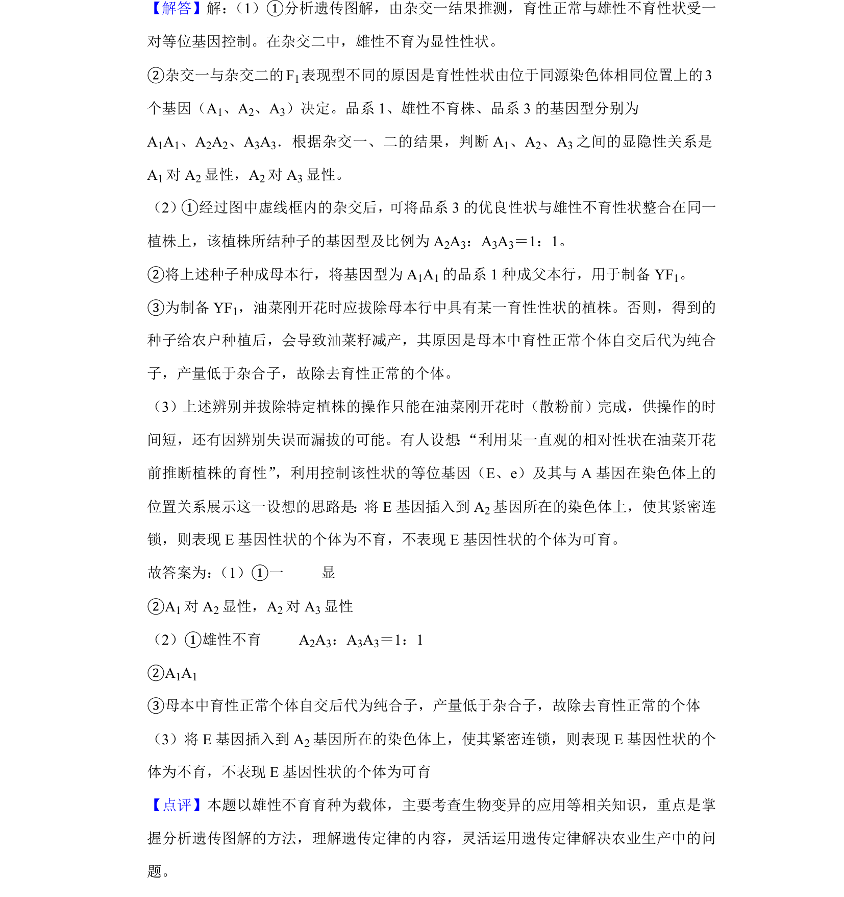

## 题面

## 摘要

本题考查油菜杂种优势与雄性不育突变株在杂交育种中的应用。

## 关联考点

- [[892-杂种优势|杂种优势]]
- [[雄性不育]]
- [[493-杂交育种|杂交育种]]
- [[517-遗传规律|遗传规律]]

## 答案与解析

> 📄 原 PDF 第 8 页：`素材/真题/北京/2008-2024·（北京）生物高考真题/2019年高考生物试卷（北京）（解析卷）.pdf`
