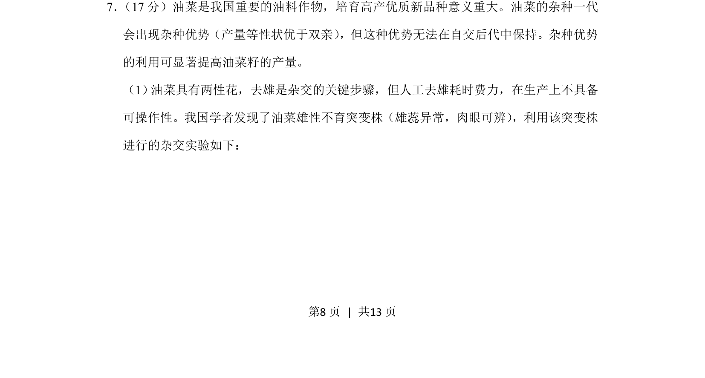
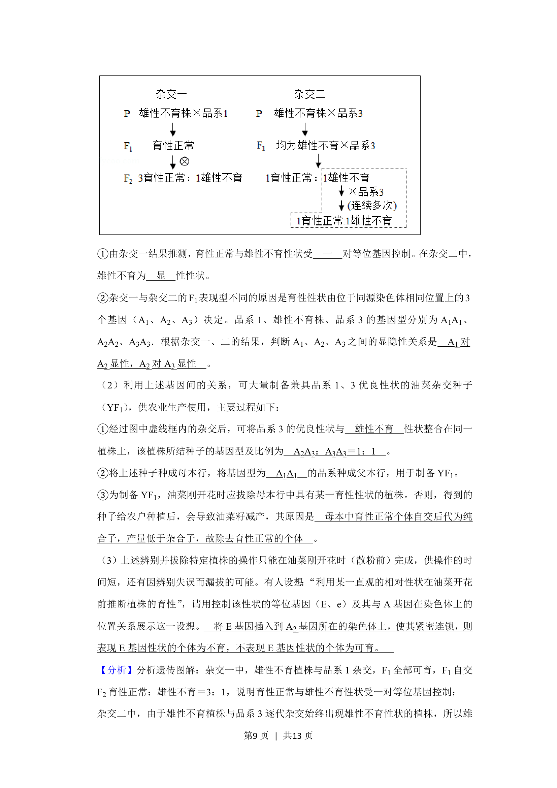
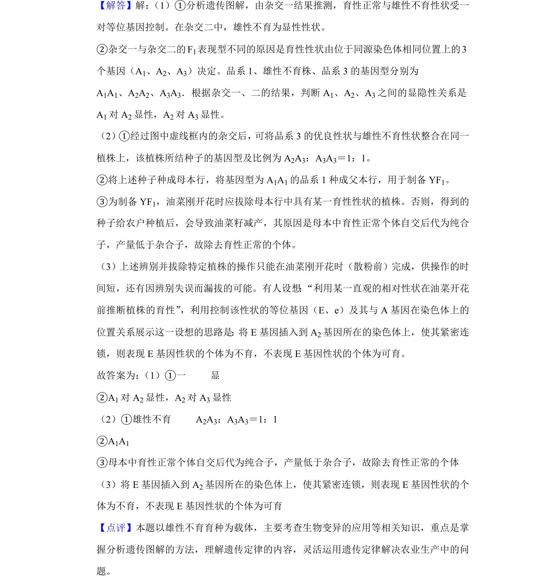

## 题面

## 摘要

本题考查油菜杂种优势与雄性不育突变株在杂交育种中的应用。

## 关联考点

- [[892-杂种优势|杂种优势]]
- [[雄性不育]]
- [[493-杂交育种|杂交育种]]
- [[517-遗传规律|遗传规律]]

## 答案与解析

> 📄 原 PDF 第 8 页：`素材/真题/北京/2008-2024·（北京）生物高考真题/2019年高考生物试卷（北京）（解析卷）.pdf`

<!-- 题干文本-start -->
## 题干文本
7． （17分）油菜是我国重要的油料作物，培育高产优质新品种意义重大。油菜的杂种一代
会出现杂种优势（产量等性状优于双亲） ，但这种优势无法在自交后代中保持。杂种优势
的利用可显著提高油菜籽的产量。
（1） 油菜具有两性花，去雄是杂交的关键步骤，但人工去雄耗时费力，在生产上不具备
可操作性。我国学者发现了油菜雄性不育突变株（雄蕊异常，肉眼可辨） ，利用该突变株
进行的杂交实验如下：
<!-- 题干文本-end -->

<!-- 解析文本-start -->
## 解析文本

<!-- 解析文本-end -->
