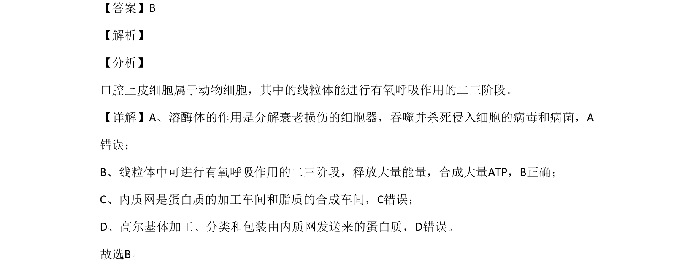

## 题面

## 摘要

本题考查动物细胞中细胞器的功能，线粒体是进行有氧呼吸二三阶段的场所

## 关联考点

- [[678-细胞器功能|细胞器功能]]
- [[228-线粒体|线粒体]]
- [[240-有氧呼吸|有氧呼吸]]

## 答案与解析

> 📄 原 PDF 第 1 页：`素材/真题/北京/2008-2024·（北京）生物高考真题/2020年高考生物试卷（北京）（解析卷）.pdf`
