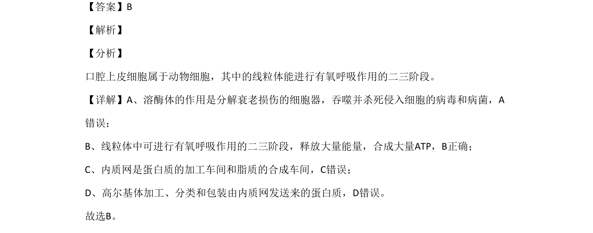

## 题面

## 摘要

本题考查动物细胞中细胞器的功能，线粒体是进行有氧呼吸二三阶段的场所

## 关联考点

- [[678-细胞器功能|细胞器功能]]
- [[228-线粒体|线粒体]]
- [[240-有氧呼吸|有氧呼吸]]

## 答案与解析

> 📄 原 PDF 第 1 页：`素材/真题/北京/2008-2024·（北京）生物高考真题/2020年高考生物试卷（北京）（解析卷）.pdf`

<!-- 题干文本-start -->
## 题干文本
1. 在口腔上皮细胞中，大量合成ATP的细胞器是（    ）
A. 溶酶体 B. 线粒体 C. 内质网 D. 高尔基体
<!-- 题干文本-end -->

<!-- 解析文本-start -->
## 解析文本
【答案】B
【解析】
【分析】
口腔上皮细胞属于动物细胞，其中的线粒体能进行有氧呼吸作用的二三阶段。
【详解】A、溶酶体的作用是分解衰老损伤的细胞器，吞噬并杀死侵入细胞的病毒和病菌，A
错误；
B、线粒体中可进行有氧呼吸作用的二三阶段，释放大量能量，合成大量ATP，B正确；
C、内质网是蛋白质的加工车间和脂质的合成车间，C错误；
D、高尔基体加工、分类和包装由内质网发送来的蛋白质，D错误。
故选B。
<!-- 解析文本-end -->
