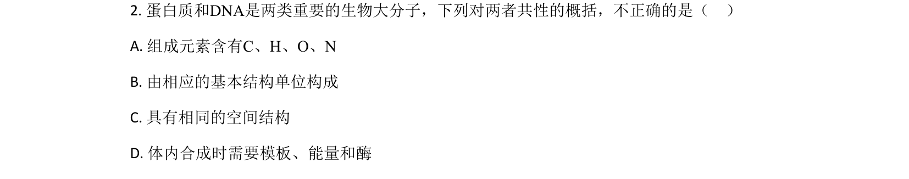
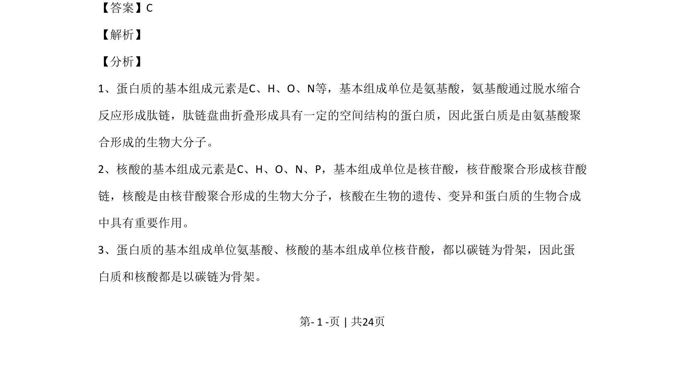
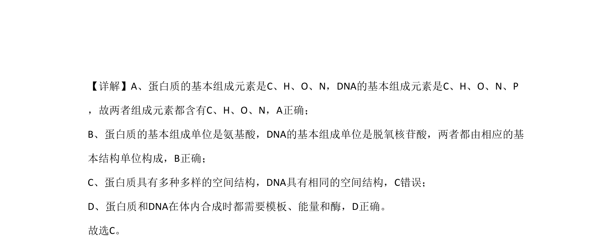

## 题面

## 摘要

考查蛋白质与DNA的组成、结构及合成，以及原核与真核细胞的统一性特征。

## 关联考点

- [[134-蛋白质|蛋白质]]
- [[192-DNA|DNA]]
- [[205-原核细胞|原核细胞]]
- [[208-真核细胞|真核细胞]]
- [[046-细胞分裂|有丝分裂]]

## 答案与解析

> 📄 原 PDF 第 1 页：`素材/真题/北京/2008-2024·（北京）生物高考真题/2020年高考生物试卷（北京）（解析卷）.pdf`
