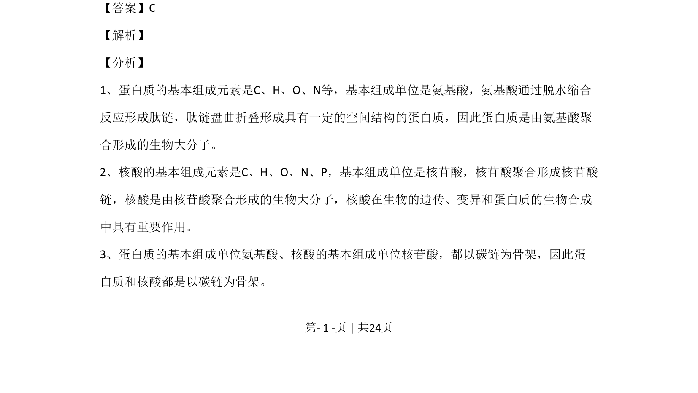
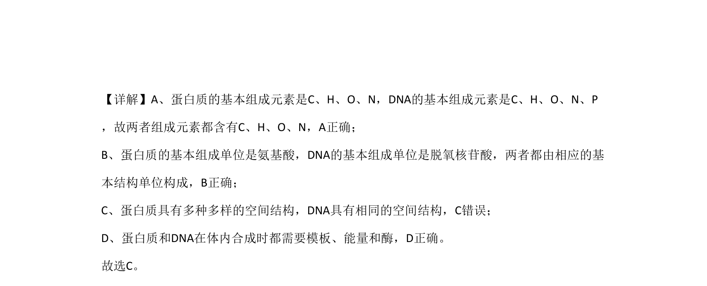

## 题面

## 摘要

考查蛋白质与DNA的组成、结构及合成，以及原核与真核细胞的统一性特征。

## 关联考点

- [[134-蛋白质|蛋白质]]
- [[192-DNA|DNA]]
- [[205-原核细胞|原核细胞]]
- [[208-真核细胞|真核细胞]]
- [[046-细胞分裂|有丝分裂]]

## 答案与解析

> 📄 原 PDF 第 1 页：`素材/真题/北京/2008-2024·（北京）生物高考真题/2020年高考生物试卷（北京）（解析卷）.pdf`

<!-- 题干文本-start -->
## 题干文本
2. 蛋白质和DNA是两类重要的生物大分子，下列对两者共性的概括，不正确的是（    ）
A. 组成元素含有C、H、O、N
B. 由相应的基本结构单位构成
C. 具有相同的空间结构
D. 体内合成时需要模板、能量和酶
<!-- 题干文本-end -->

<!-- 解析文本-start -->
## 解析文本
【答案】C
【解析】
【分析】
1、蛋白质的基本组成元素是C、H、O、N等，基本组成单位是氨基酸，氨基酸通过脱水缩合
反应形成肽链，肽链盘曲折叠形成具有一定的空间结构的蛋白质，因此蛋白质是由氨基酸聚
合形成的生物大分子。
2、核酸的基本组成元素是C、H、O、N、P，基本组成单位是核苷酸，核苷酸聚合形成核苷酸
链，核酸是由核苷酸聚合形成的生物大分子，核酸在生物的遗传、变异和蛋白质的生物合成
中具有重要作用。
<!-- 解析文本-end -->
