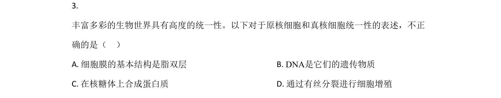
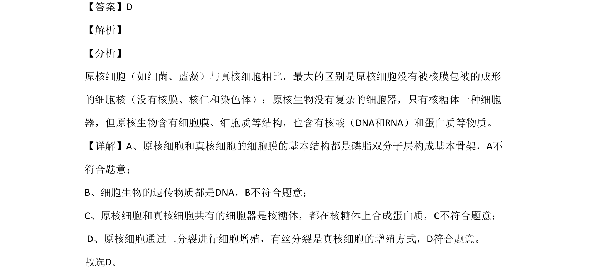

## 题面

## 摘要

考查原核细胞与真核细胞的结构区别，以及酶活性影响因素的实验分析。

## 关联考点

- [[原核细胞与真核细胞异同]]
- [[细胞增殖方式]]
- [[酶活性影响因素]]

## 答案与解析

> 📄 原 PDF 第 2 页：`素材/真题/北京/2008-2024·（北京）生物高考真题/2020年高考生物试卷（北京）（解析卷）.pdf`

<!-- 题干文本-start -->
## 题干文本
3. 
丰富多彩的生物世界具有高度的统一性。以下对于原核细胞和真核细胞统一性的表述，不正
确的是（    ）
A. 细胞膜的基本结构是脂双层 B. DNA是它们的遗传物质
C. 在核糖体上合成蛋白质 D. 通过有丝分裂进行细胞增殖
<!-- 题干文本-end -->

<!-- 解析文本-start -->
## 解析文本
【答案】D
【解析】
【分析】
原核细胞（如细菌、蓝藻）与真核细胞相比，最大的区别是原核细胞没有被核膜包被的成形
的细胞核（没有核膜、核仁和染色体）；原核生物没有复杂的细胞器，只有核糖体一种细胞
器，但原核生物含有细胞膜、细胞质等结构，也含有核酸（DNA和RNA）和蛋白质等物质。
【详解】A、原核细胞和真核细胞的细胞膜的基本结构都是磷脂双分子层构成基本骨架，A不
符合题意； 
B、细胞生物的遗传物质都是DNA，B不符合题意；
C、原核细胞和真核细胞共有的细胞器是核糖体，都在核糖体上合成蛋白质，C不符合题意；
 D、原核细胞通过二分裂进行细胞增殖，有丝分裂是真核细胞的增殖方式，D符合题意。
故选D。
<!-- 解析文本-end -->
