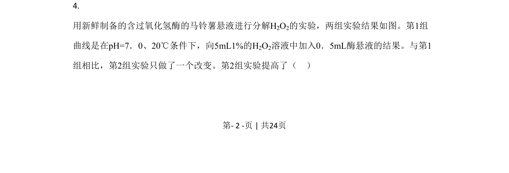
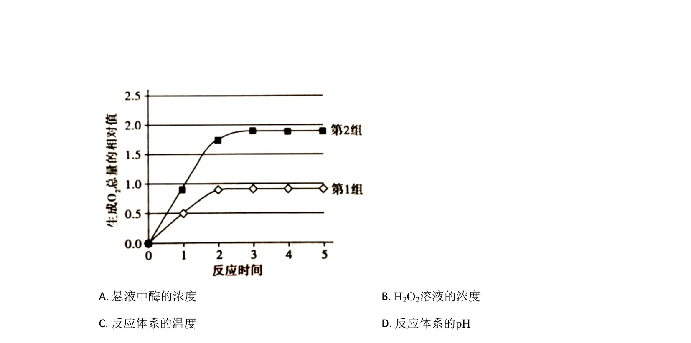
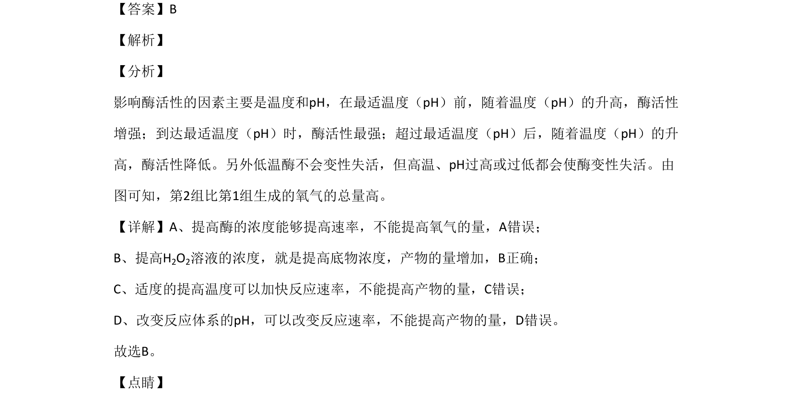

## 题面

## 摘要

考查H₂O₂溶液浓度和pH对酶促反应产物量的影响，辨析速率与总量的差异

## 关联考点

- [[518-酶活性|酶活性]]
- [[595-底物浓度|底物浓度]]
- [[产物量]]
- [[485-对照实验|对照实验]]

## 答案与解析

> 📄 原 PDF 第 2 页：`素材/真题/北京/2008-2024·（北京）生物高考真题/2020年高考生物试卷（北京）（解析卷）.pdf`
