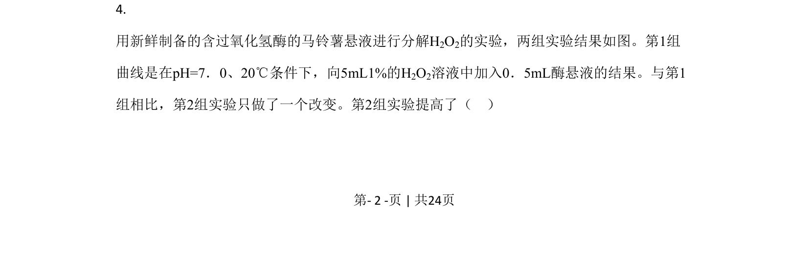
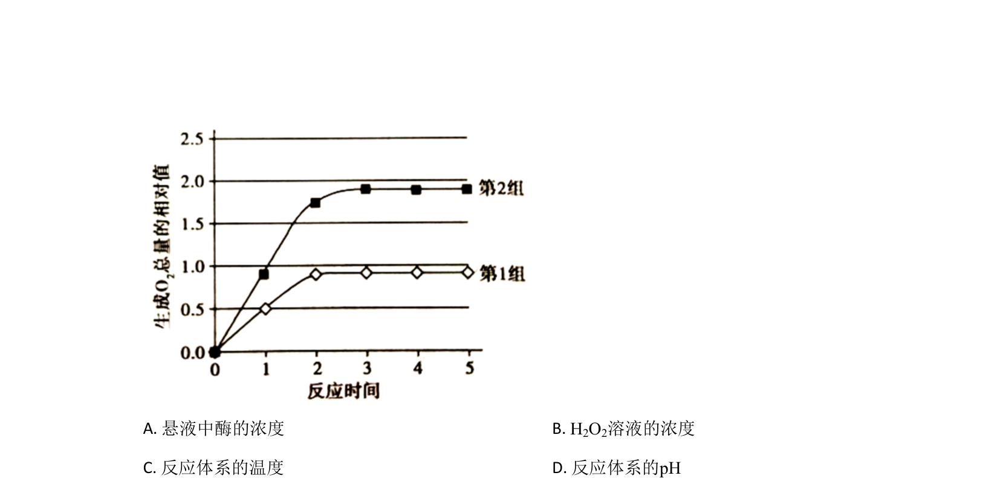
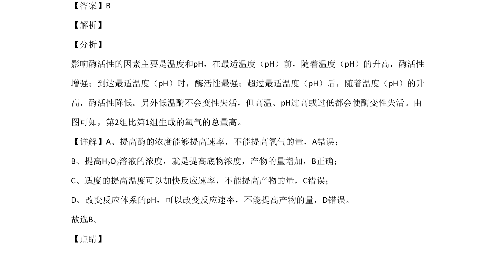

## 题面

## 摘要

考查H₂O₂溶液浓度和pH对酶促反应产物量的影响，辨析速率与总量的差异

## 关联考点

- [[518-酶活性|酶活性]]
- [[595-底物浓度|底物浓度]]
- [[产物量]]
- [[485-对照实验|对照实验]]

## 答案与解析

> 📄 原 PDF 第 2 页：`素材/真题/北京/2008-2024·（北京）生物高考真题/2020年高考生物试卷（北京）（解析卷）.pdf`

<!-- 题干文本-start -->
## 题干文本
4. 
用新鲜制备的含过氧化氢酶的马铃薯悬液进行分解H2O2的实验，两组实验结果如图。第1组
曲线是在pH=7．0、20℃条件下，向5mL1%的H2O2溶液中加入0．5mL酶悬液的结果。与第1
组相比，第2组实验只做了一个改变。第2组实验提高了（    ）
<!-- 题干文本-end -->

<!-- 解析文本-start -->
## 解析文本

<!-- 解析文本-end -->
