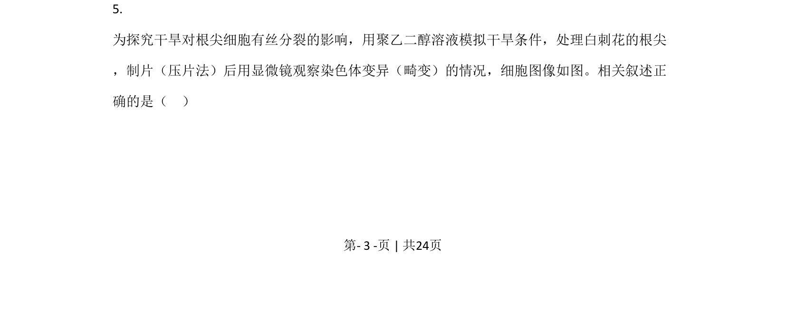
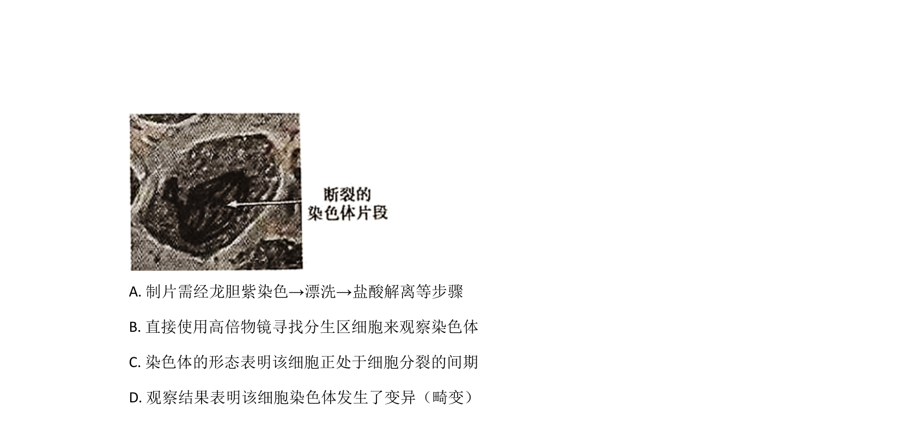
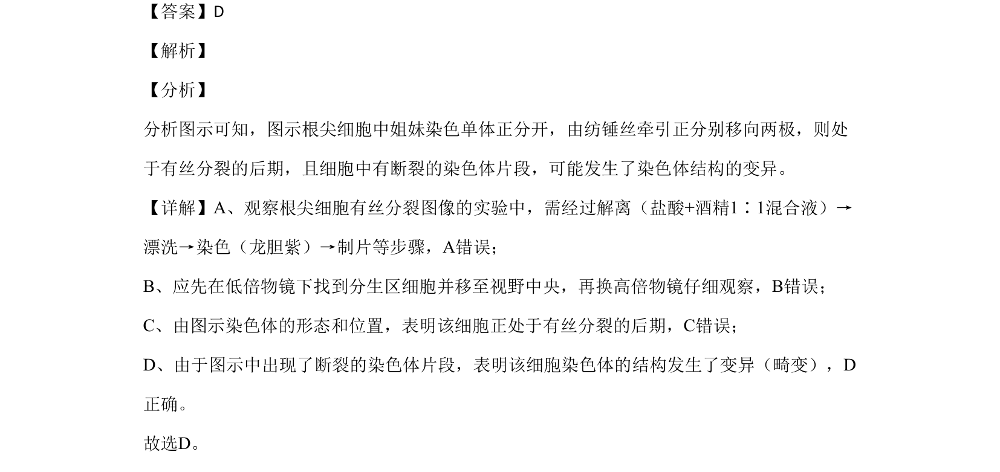

## 题面

## 摘要

本题结合根尖细胞分裂图示，考查有丝分裂过程、观察实验操作及染色体结构变异判断

## 关联考点

- [[有丝分裂后期]]
- [[306-染色体结构变异|染色体结构变异]]
- [[观察根尖分生组织细胞的有丝分裂]]

## 答案与解析

> 📄 原 PDF 第 3 页：`素材/真题/北京/2008-2024·（北京）生物高考真题/2020年高考生物试卷（北京）（解析卷）.pdf`
