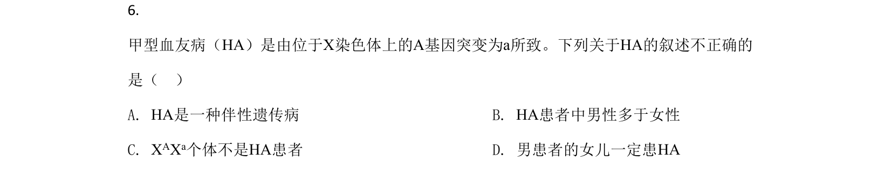
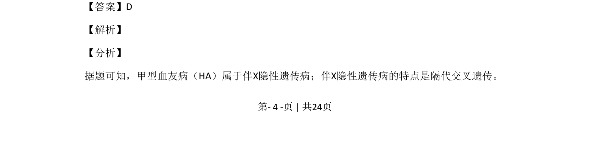
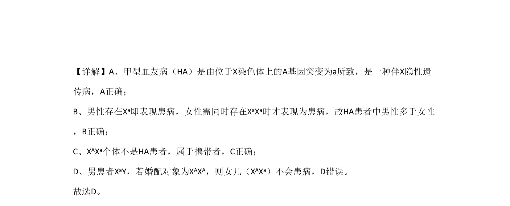

## 题面

## 摘要

本题以甲型血友病为例考查伴X隐性遗传的特点及基因型分析。

## 关联考点

- [[802-伴X隐性遗传|伴X隐性遗传]]
- [[301-基因突变|基因突变]]
- [[携带者]]
- [[299-人类遗传病|遗传病]]

## 答案与解析

> 📄 原 PDF 第 4 页：`素材/真题/北京/2008-2024·（北京）生物高考真题/2020年高考生物试卷（北京）（解析卷）.pdf`
