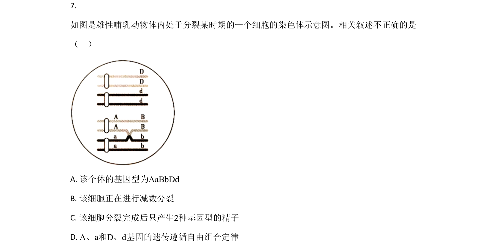
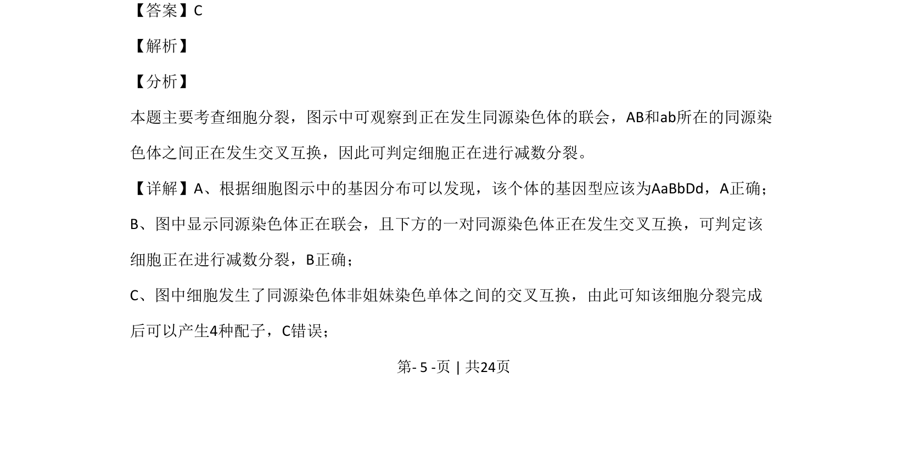

## 题面

## 摘要

该题通过细胞分裂图示考查减数分裂过程中同源染色体联会、交叉互换及基因自由组合定律。

## 关联考点

- [[277-减数分裂（高中必二）|减数分裂]]
- [[同源染色体联会]]
- [[539-交叉互换|交叉互换]]
- [[580-基因自由组合定律|基因自由组合定律]]

## 答案与解析

> 📄 原 PDF 第 5 页：`素材/真题/北京/2008-2024·（北京）生物高考真题/2020年高考生物试卷（北京）（解析卷）.pdf`
