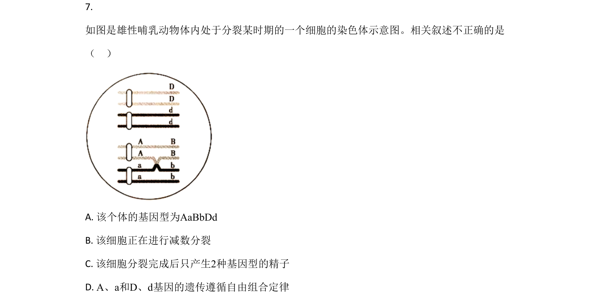
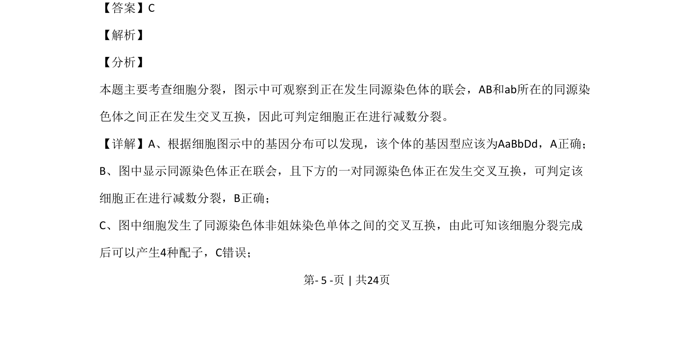

## 题面

## 摘要

该题通过细胞分裂图示考查减数分裂过程中同源染色体联会、交叉互换及基因自由组合定律。

## 关联考点

- [[277-减数分裂（高中必二）|减数分裂]]
- [[同源染色体联会]]
- [[539-交叉互换|交叉互换]]
- [[580-基因自由组合定律|基因自由组合定律]]

## 答案与解析

> 📄 原 PDF 第 5 页：`素材/真题/北京/2008-2024·（北京）生物高考真题/2020年高考生物试卷（北京）（解析卷）.pdf`

<!-- 题干文本-start -->
## 题干文本
7. 
如图是雄性哺乳动物体内处于分裂某时期的一个细胞的染色体示意图。相关叙述不正确的是
（    ）
A. 该个体的基因型为AaBbDd
B. 该细胞正在进行减数分裂
C. 该细胞分裂完成后只产生2种基因型的精子
D. A、a和D、d基因的遗传遵循自由组合定律
<!-- 题干文本-end -->

<!-- 解析文本-start -->
## 解析文本
【答案】C
【解析】
【分析】
本题主要考查细胞分裂，图示中可观察到正在发生同源染色体的联会，AB和ab所在的同源染
色体之间正在发生交叉互换，因此可判定细胞正在进行减数分裂。
【详解】A、根据细胞图示中的基因分布可以发现，该个体的基因型应该为AaBbDd，A正确；
B、图中显示同源染色体正在联会，且下方的一对同源染色体正在发生交叉互换，可判定该
细胞正在进行减数分裂，B正确；
C、图中细胞发生了同源染色体非姐妹染色单体之间的交叉互换，由此可知该细胞分裂完成
后可以产生4种配子，C错误；
<!-- 解析文本-end -->
