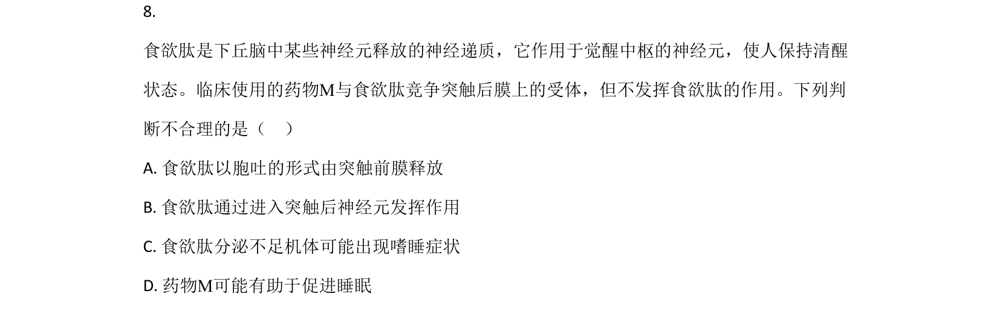
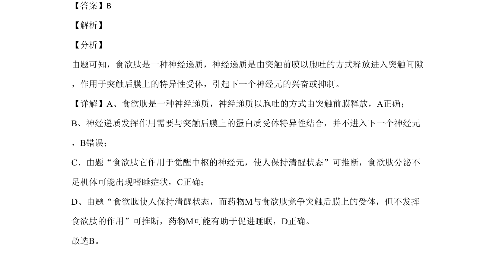

## 题面

## 摘要

食欲肽作为神经递质的释放方式、作用特点及功能推断

## 关联考点

- [[325-神经递质|神经递质]]
- [[259-胞吐|胞吐]]
- [[突触后膜受体]]
- [[兴奋或抑制]]

## 答案与解析

> 📄 原 PDF 第 6 页：`素材/真题/北京/2008-2024·（北京）生物高考真题/2020年高考生物试卷（北京）（解析卷）.pdf`

<!-- 题干文本-start -->
## 题干文本
8. 
食欲肽是下丘脑中某些神经元释放的神经递质，它作用于觉醒中枢的神经元，使人保持清醒
状态。临床使用的药物M与食欲肽竞争突触后膜上的受体，但不发挥食欲肽的作用。下列判
断不合理的是（    ）
A. 食欲肽以胞吐的形式由突触前膜释放
B. 食欲肽通过进入突触后神经元发挥作用
C. 食欲肽分泌不足机体可能出现嗜睡症状
D. 药物M可能有助于促进睡眠
<!-- 题干文本-end -->

<!-- 解析文本-start -->
## 解析文本
【答案】B
【解析】
【分析】
由题可知，食欲肽是一种神经递质，神经递质是由突触前膜以胞吐的方式释放进入突触间隙
，作用于突触后膜上的特异性受体，引起下一个神经元的兴奋或抑制。
【详解】A、食欲肽是一种神经递质，神经递质以胞吐的方式由突触前膜释放，A正确；
B、神经递质发挥作用需要与突触后膜上的蛋白质受体特异性结合，并不进入下一个神经元
，B错误；
C、由题“食欲肽它作用于觉醒中枢的神经元，使人保持清醒状态”可推断，食欲肽分泌不
足机体可能出现嗜睡症状，C正确；
D、由题“食欲肽使人保持清醒状态，而药物M与食欲肽竞争突触后膜上的受体，但不发挥
食欲肽的作用”可推断，药物M可能有助于促进睡眠，D正确。
故选B。
<!-- 解析文本-end -->
