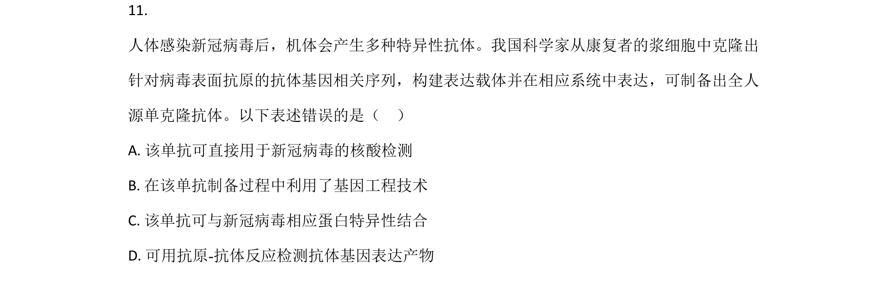
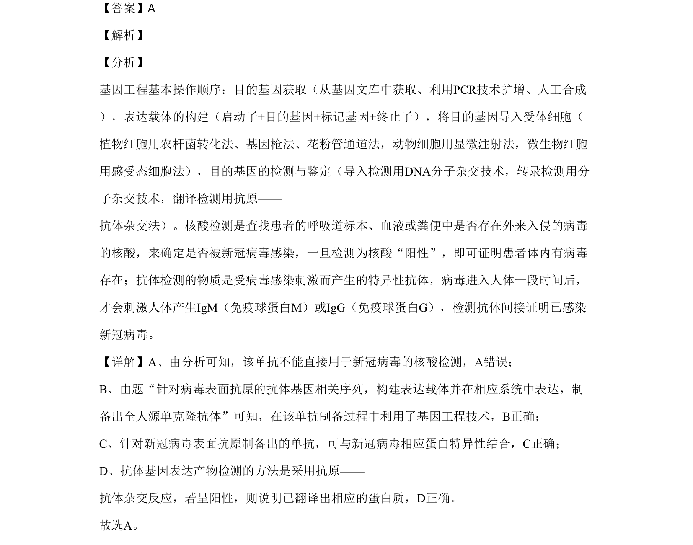

## 题面

## 摘要

基因工程制备单抗与核酸检测，及转基因杨树中HMA3基因的PCR引物选择避免内源干扰

## 关联考点

- [[411-基因工程|基因工程]]
- [[451-单克隆抗体|单克隆抗体]]
- [[886-PCR引物设计|PCR引物设计]]
- [[494-核酸检测|核酸检测]]

## 答案与解析

> 📄 原 PDF 第 9 页：`素材/真题/北京/2008-2024·（北京）生物高考真题/2020年高考生物试卷（北京）（解析卷）.pdf`
