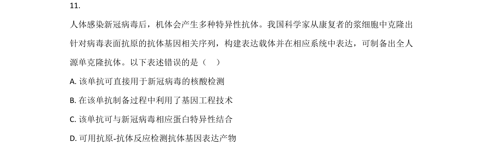
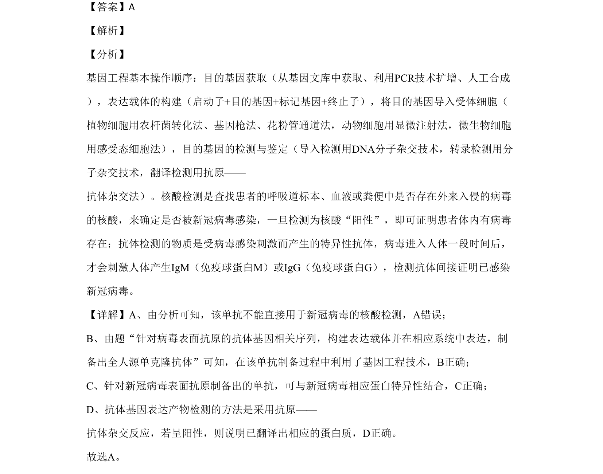

## 题面

## 摘要

基因工程制备单抗与核酸检测，及转基因杨树中HMA3基因的PCR引物选择避免内源干扰

## 关联考点

- [[411-基因工程|基因工程]]
- [[451-单克隆抗体|单克隆抗体]]
- [[886-PCR引物设计|PCR引物设计]]
- [[494-核酸检测|核酸检测]]

## 答案与解析

> 📄 原 PDF 第 9 页：`素材/真题/北京/2008-2024·（北京）生物高考真题/2020年高考生物试卷（北京）（解析卷）.pdf`

<!-- 题干文本-start -->
## 题干文本
11. 
人体感染新冠病毒后，机体会产生多种特异性抗体。我国科学家从康复者的浆细胞中克隆出
针对病毒表面抗原的抗体基因相关序列，构建表达载体并在相应系统中表达，可制备出全人
源单克隆抗体。以下表述错误的是（    ）
A. 该单抗可直接用于新冠病毒的核酸检测
B. 在该单抗制备过程中利用了基因工程技术
C. 该单抗可与新冠病毒相应蛋白特异性结合
D. 可用抗原-抗体反应检测抗体基因表达产物
<!-- 题干文本-end -->

<!-- 解析文本-start -->
## 解析文本
【答案】A
【解析】
【分析】
基因工程基本操作顺序：目的基因获取（从基因文库中获取、利用PCR技术扩增、人工合成
），表达载体的构建（启动子+目的基因+标记基因+终止子），将目的基因导入受体细胞（
植物细胞用农杆菌转化法、基因枪法、花粉管通道法，动物细胞用显微注射法，微生物细胞
用感受态细胞法），目的基因的检测与鉴定（导入检测用DNA分子杂交技术，转录检测用分
子杂交技术，翻译检测用抗原——
抗体杂交法）。核酸检测是查找患者的呼吸道标本、血液或粪便中是否存在外来入侵的病毒
的核酸，来确定是否被新冠病毒感染，一旦检测为核酸“阳性”，即可证明患者体内有病毒
存在；抗体检测的物质是受病毒感染刺激而产生的特异性抗体，病毒进入人体一段时间后，
才会刺激人体产生IgM（免疫球蛋白M）或IgG（免疫球蛋白G），检测抗体间接证明已感染
新冠病毒。
【详解】A、由分析可知，该单抗不能直接用于新冠病毒的核酸检测，A错误；
B、由题“针对病毒表面抗原的抗体基因相关序列，构建表达载体并在相应系统中表达，制
备出全人源单克隆抗体”可知，在该单抗制备过程中利用了基因工程技术，B正确；
C、针对新冠病毒表面抗原制备出的单抗，可与新冠病毒相应蛋白特异性结合，C正确；
D、抗体基因表达产物检测的方法是采用抗原——
抗体杂交反应，若呈阳性，则说明已翻译出相应的蛋白质，D正确。
故选A。
<!-- 解析文本-end -->
