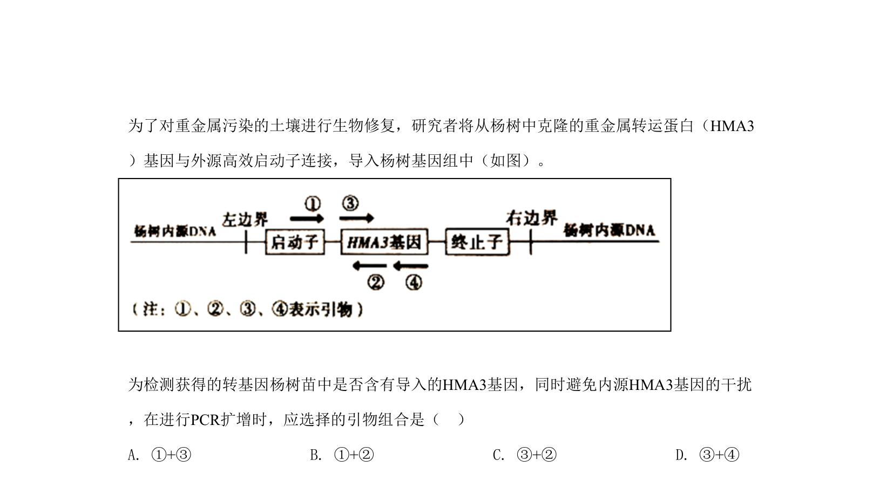
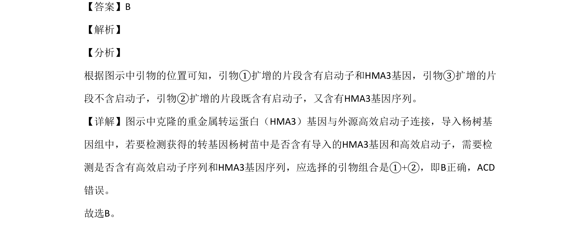

## 题面

## 摘要

利用PCR引物检测转基因杨树中是否同时含有外源启动子和目的基因序列

## 关联考点

- [[886-PCR引物设计|PCR引物设计]]
- [[907-基因表达载体|基因表达载体]]
- [[747-目的基因检测|目的基因检测]]

## 答案与解析

> 📄 原 PDF 第 9 页：`素材/真题/北京/2008-2024·（北京）生物高考真题/2020年高考生物试卷（北京）（解析卷）.pdf`
