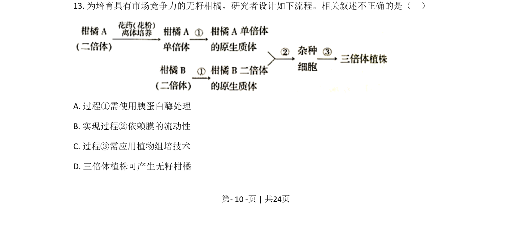
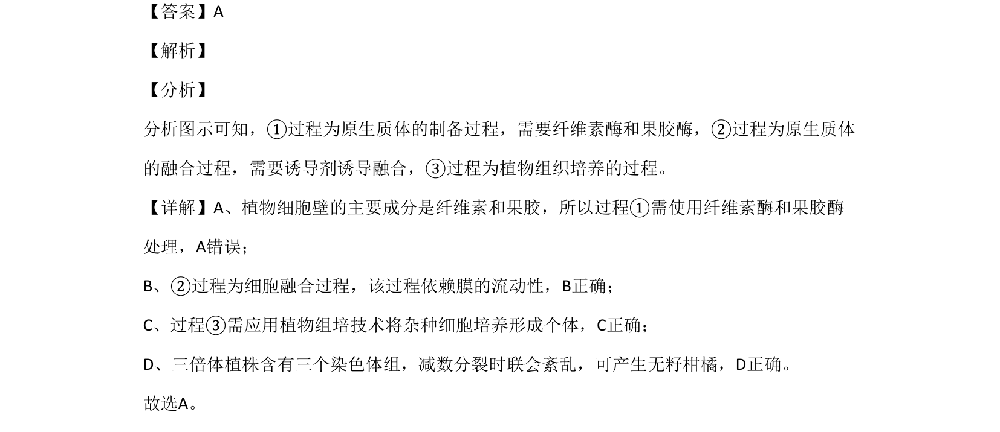

## 题面

## 摘要

植物原生质体制备、融合及组织培养过程分析，三倍体无籽柑橘培育

## 关联考点

- [[887-原生质体|原生质体]]
- [[细胞融合]]
- [[437-植物组织培养|植物组织培养]]
- [[三倍体]]

## 答案与解析

> 📄 原 PDF 第 10 页：`素材/真题/北京/2008-2024·（北京）生物高考真题/2020年高考生物试卷（北京）（解析卷）.pdf`
