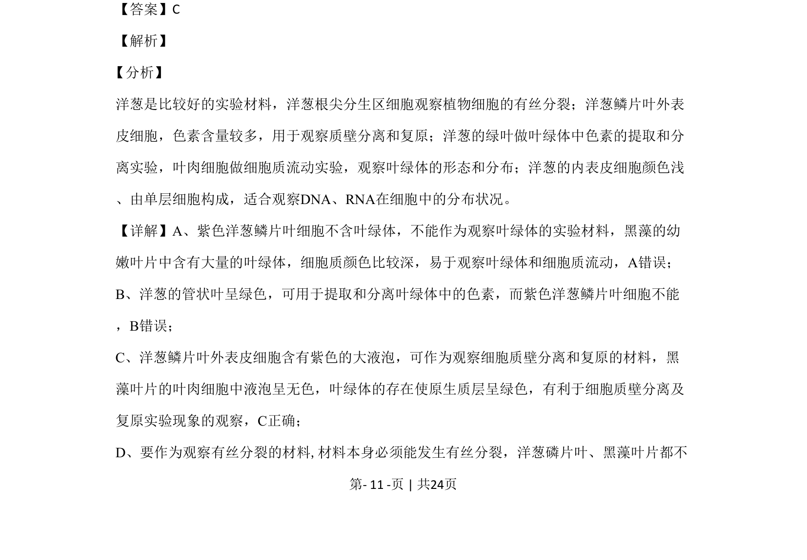
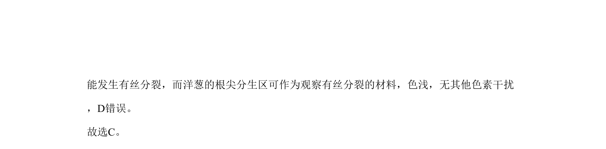

## 题面

## 摘要

考查洋葱和黑藻等材料在叶绿体观察、色素提取、质壁分离及有丝分裂等实验中的适用性。

## 关联考点

- [[观察叶绿体]]
- [[质壁分离和复原]]
- [[有丝分裂实验材料]]
- [[叶绿体中色素的提取和分离]]

## 答案与解析

> 📄 原 PDF 第 11 页：`素材/真题/北京/2008-2024·（北京）生物高考真题/2020年高考生物试卷（北京）（解析卷）.pdf`
