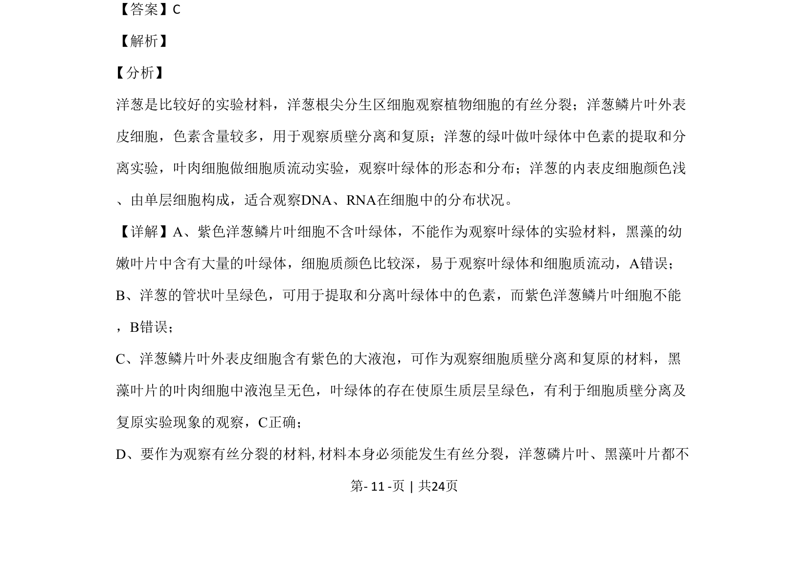
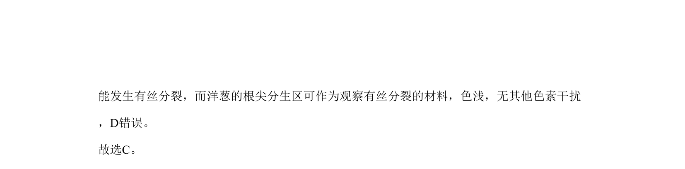

## 题面

## 摘要

考查洋葱和黑藻等材料在叶绿体观察、色素提取、质壁分离及有丝分裂等实验中的适用性。

## 关联考点

- [[观察叶绿体]]
- [[质壁分离和复原]]
- [[有丝分裂实验材料]]
- [[叶绿体中色素的提取和分离]]

## 答案与解析

> 📄 原 PDF 第 11 页：`素材/真题/北京/2008-2024·（北京）生物高考真题/2020年高考生物试卷（北京）（解析卷）.pdf`

<!-- 题干文本-start -->
## 题干文本
14. 下列高中生物学实验中，用紫色的洋葱鳞片叶和黑藻叶片作为实验材料均可完成的是（    
）
A. 观察叶绿体和细胞质流动 B. 提取和分离叶绿素
C. 观察细胞质壁分离及复原 D. 观察细胞的有丝分裂
<!-- 题干文本-end -->

<!-- 解析文本-start -->
## 解析文本
【答案】C
【解析】
分析】
洋葱是比较好的实验材料，洋葱根尖分生区细胞观察植物细胞的有丝分裂；洋葱鳞片叶外表
皮细胞，色素含量较多，用于观察质壁分离和复原；洋葱的绿叶做叶绿体中色素的提取和分
离实验，叶肉细胞做细胞质流动实验，观察叶绿体的形态和分布；洋葱的内表皮细胞颜色浅
、由单层细胞构成，适合观察DNA、RNA在细胞中的分布状况。
【详解】A、紫色洋葱鳞片叶细胞不含叶绿体，不能作为观察叶绿体的实验材料，黑藻的幼
嫩叶片中含有大量的叶绿体，细胞质颜色比较深，易于观察叶绿体和细胞质流动，A错误；
B、洋葱的管状叶呈绿色，可用于提取和分离叶绿体中的色素，而紫色洋葱鳞片叶细胞不能
，B错误；
C、洋葱鳞片叶外表皮细胞含有紫色的大液泡，可作为观察细胞质壁分离和复原的材料，黑
藻叶片的叶肉细胞中液泡呈无色，叶绿体的存在使原生质层呈绿色，有利于细胞质壁分离及
复原实验现象的观察，C正确；
D、要作为观察有丝分裂的材料,材料本身必须能发生有丝分裂，洋葱磷片叶、黑藻叶片都不
【
<!-- 解析文本-end -->
