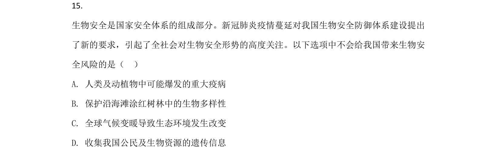
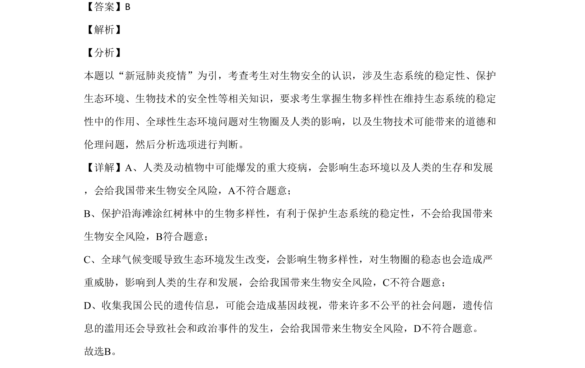

## 题面

## 摘要

北极狐引入岛屿导致植物群落变化，涉及生态系统组成、海鸟密度调查及土壤肥力实验分析

## 关联考点

- [[生态系统组成成分]]
- [[食物链与营养级]]
- [[407-群落演替|群落演替]]
- [[889-土壤肥力|土壤肥力]]

## 答案与解析

> 📄 原 PDF 第 12 页：`素材/真题/北京/2008-2024·（北京）生物高考真题/2020年高考生物试卷（北京）（解析卷）.pdf`
