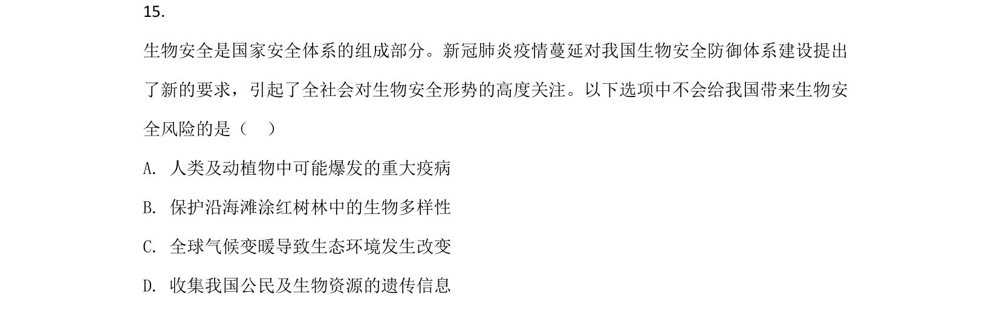
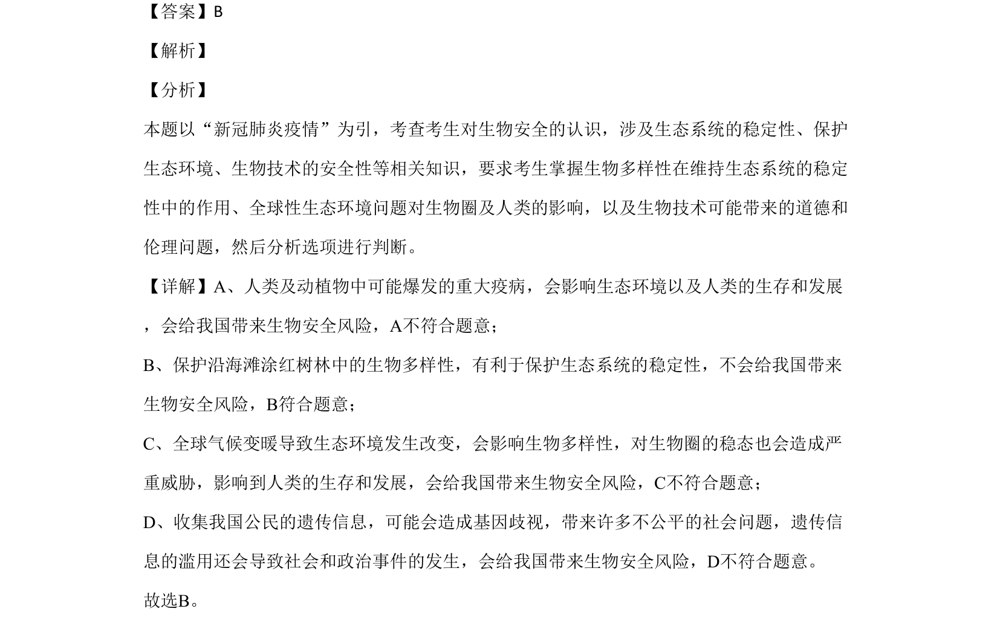

## 题面

## 摘要

北极狐引入岛屿导致植物群落变化，涉及生态系统组成、海鸟密度调查及土壤肥力实验分析

## 关联考点

- [[生态系统组成成分]]
- [[食物链与营养级]]
- [[407-群落演替|群落演替]]
- [[889-土壤肥力|土壤肥力]]

## 答案与解析

> 📄 原 PDF 第 12 页：`素材/真题/北京/2008-2024·（北京）生物高考真题/2020年高考生物试卷（北京）（解析卷）.pdf`

<!-- 题干文本-start -->
## 题干文本
15. 
生物安全是国家安全体系的组成部分。新冠肺炎疫情蔓延对我国生物安全防御体系建设提出
了新的要求，引起了全社会对生物安全形势的高度关注。以下选项中不会给我国带来生物安
全风险的是（    ）
A. 人类及动植物中可能爆发的重大疫病
B. 保护沿海滩涂红树林中的生物多样性
C. 全球气候变暖导致生态环境发生改变
D. 收集我国公民及生物资源的遗传信息
<!-- 题干文本-end -->

<!-- 解析文本-start -->
## 解析文本
【答案】B
【解析】
【分析】
本题以“新冠肺炎疫情”为引，考查考生对生物安全的认识，涉及生态系统的稳定性、保护
生态环境、生物技术的安全性等相关知识，要求考生掌握生物多样性在维持生态系统的稳定
性中的作用、全球性生态环境问题对生物圈及人类的影响，以及生物技术可能带来的道德和
伦理问题，然后分析选项进行判断。
【详解】A、人类及动植物中可能爆发的重大疫病，会影响生态环境以及人类的生存和发展
，会给我国带来生物安全风险，A不符合题意；
B、保护沿海滩涂红树林中的生物多样性，有利于保护生态系统的稳定性，不会给我国带来
生物安全风险，B符合题意；
C、全球气候变暖导致生态环境发生改变，会影响生物多样性，对生物圈的稳态也会造成严
重威胁，影响到人类的生存和发展，会给我国带来生物安全风险，C不符合题意；
D、收集我国公民的遗传信息，可能会造成基因歧视，带来许多不公平的社会问题，遗传信
息的滥用还会导致社会和政治事件的发生，会给我国带来生物安全风险，D不符合题意。
故选B。
<!-- 解析文本-end -->
