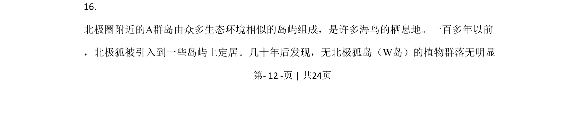
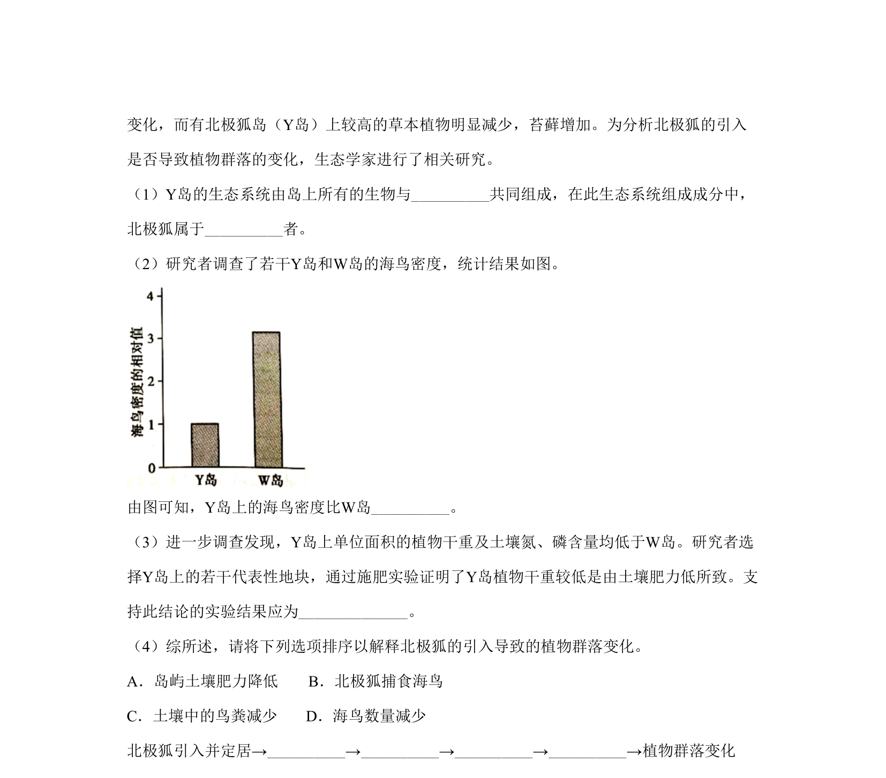
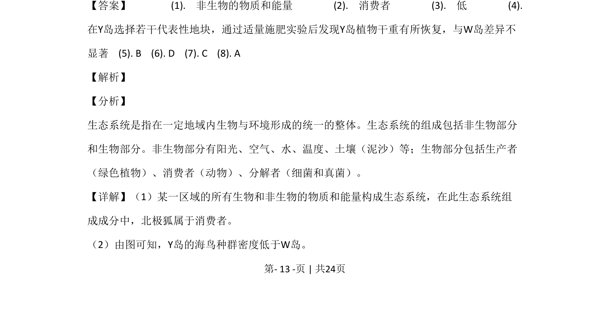
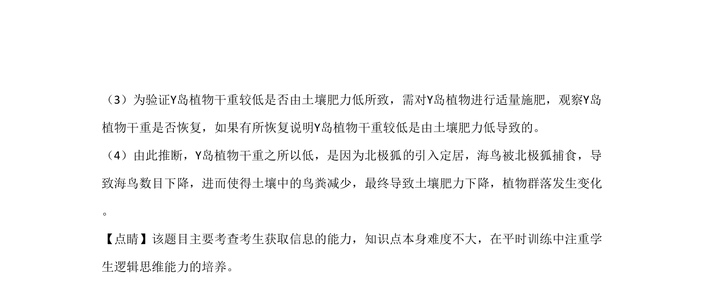

## 题面

## 摘要

该题以北极狐引入影响海岛生态系统为例考查生态系统的组成、种群密度及实验设计，同时考查纤维素酶基因工程中糖类水解、密码子简并性、基因表达载体构建及工程菌应用。

## 关联考点

- [[020-生态系统|生态系统]]
- [[381-消费者|消费者]]
- [[370-种群密度|种群密度]]
- [[土壤肥力]]
- [[密码子简并性]]
- [[基因表达载体]]

## 答案与解析

> 📄 原 PDF 第 12 页：`素材/真题/北京/2008-2024·（北京）生物高考真题/2020年高考生物试卷（北京）（解析卷）.pdf`
