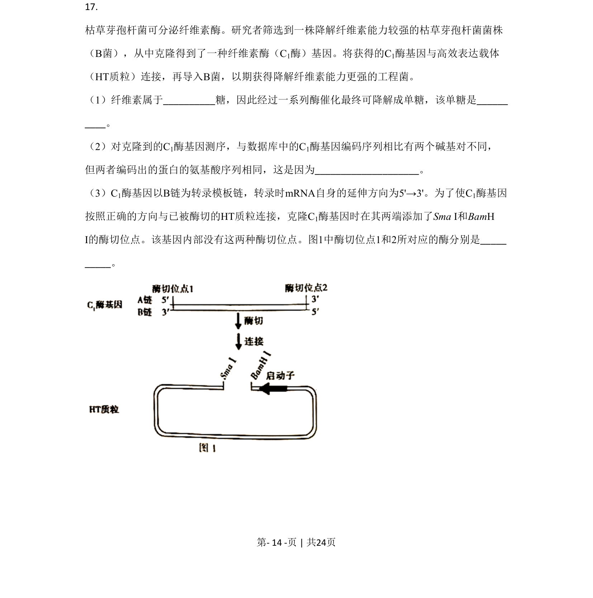
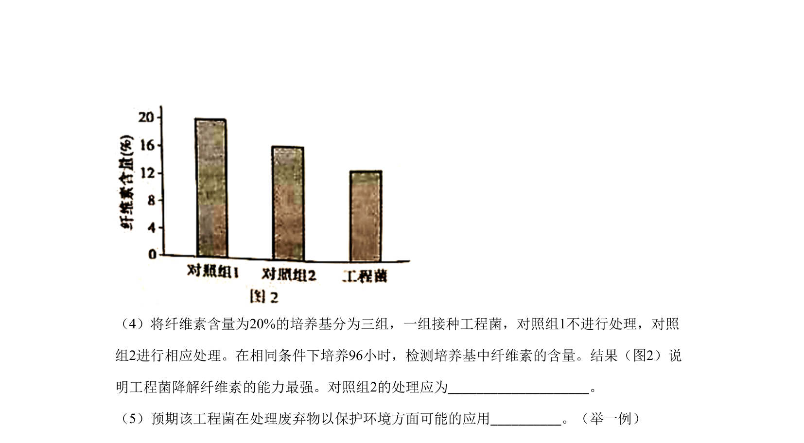
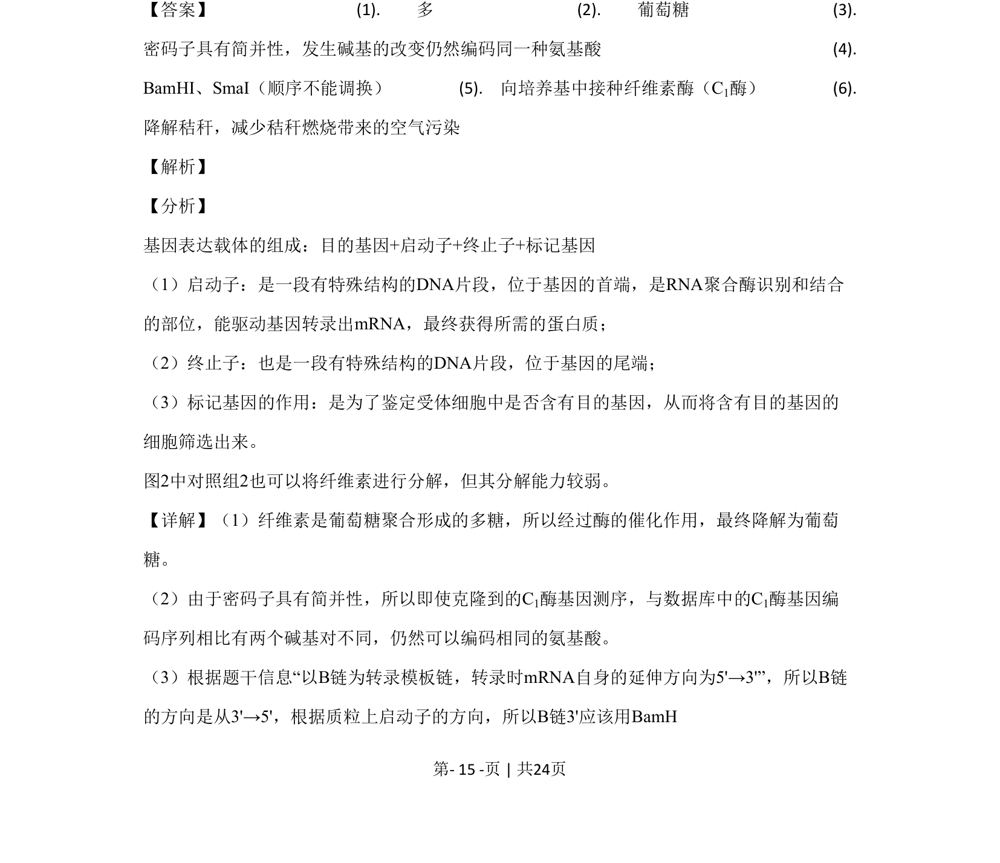
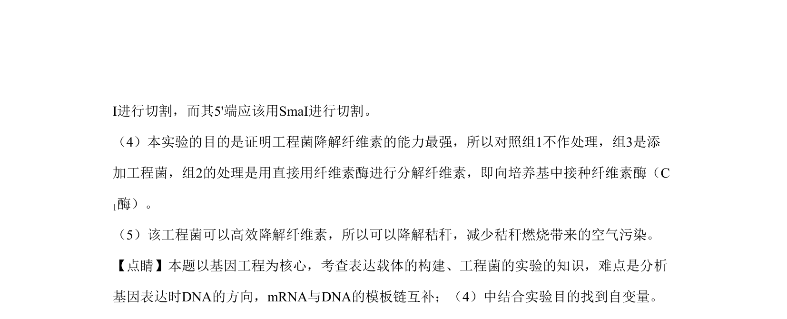

## 题面

## 摘要

本题以基因工程为核心，考查表达载体构建、工程菌降解纤维素的实验设计与分析。

## 关联考点

- [[411-基因工程|基因工程]]
- [[表达载体]]
- [[750-启动子|启动子]]
- [[482-实验设计|实验设计]]

## 答案与解析

> 📄 原 PDF 第 14 页：`素材/真题/北京/2008-2024·（北京）生物高考真题/2020年高考生物试卷（北京）（解析卷）.pdf`
