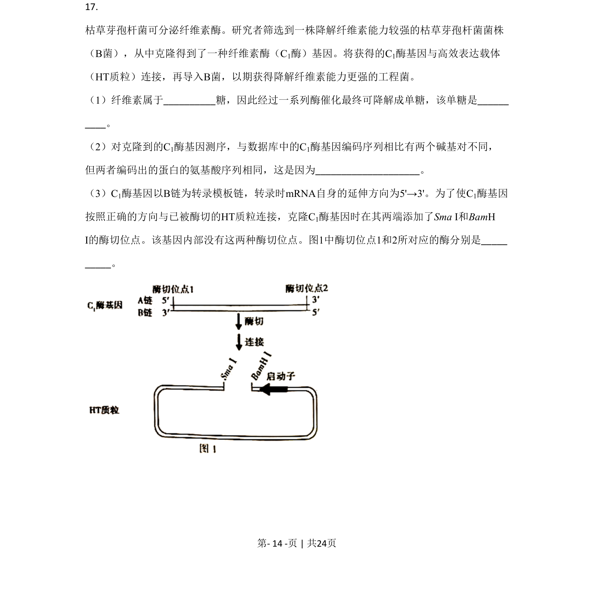
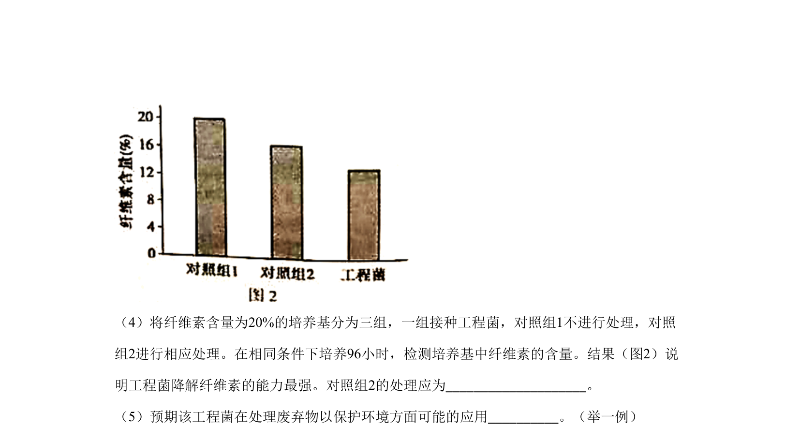
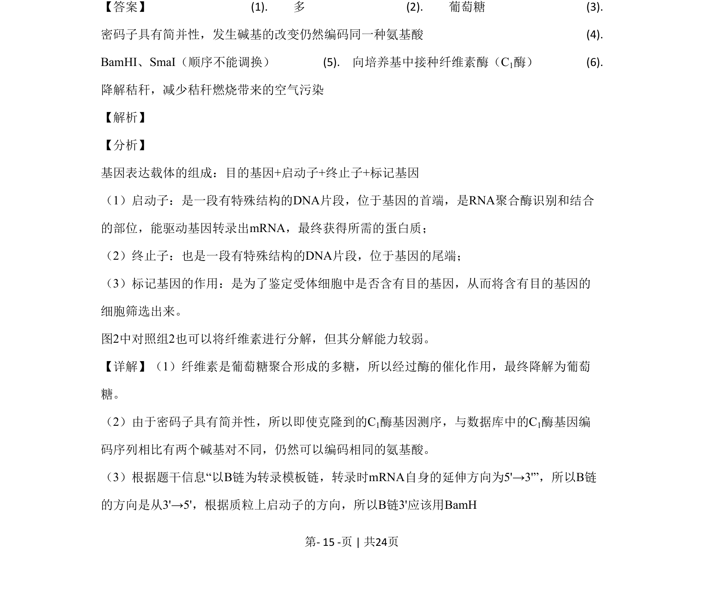
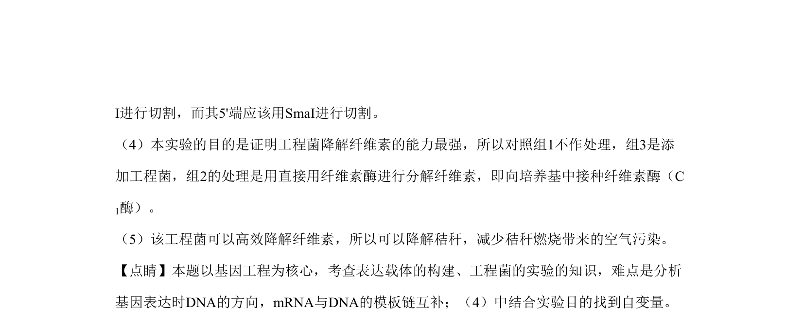

## 题面

## 摘要

本题以基因工程为核心，考查表达载体构建、工程菌降解纤维素的实验设计与分析。

## 关联考点

- [[411-基因工程|基因工程]]
- [[表达载体]]
- [[750-启动子|启动子]]
- [[482-实验设计|实验设计]]

## 答案与解析

> 📄 原 PDF 第 14 页：`素材/真题/北京/2008-2024·（北京）生物高考真题/2020年高考生物试卷（北京）（解析卷）.pdf`

<!-- 题干文本-start -->
## 题干文本
17. 
枯草芽孢杆菌可分泌纤维素酶。研究者筛选到一株降解纤维素能力较强的枯草芽孢杆菌菌株
（B菌），从中克隆得到了一种纤维素酶（C1酶）基因。将获得的C1酶基因与高效表达载体
（HT质粒）连接，再导入B菌，以期获得降解纤维素能力更强的工程菌。
（1）纤维素属于__________糖，因此经过一系列酶催化最终可降解成单糖，该单糖是______
____。
（2）对克隆到的C1酶基因测序，与数据库中的C1酶基因编码序列相比有两个碱基对不同，
但两者编码出的蛋白的氨基酸序列相同，这是因为____________________。
（3）C1酶基因以B链为转录模板链，转录时mRNA自身的延伸方向为5'→3'。为了使C1酶基因
按照正确的方向与已被酶切的HT质粒连接，克隆C1酶基因时在其两端添加了Sma I和BamH 
I的酶切位点。该基因内部没有这两种酶切位点。图1中酶切位点1和2所对应的酶分别是_____
_____。
  
的
<!-- 题干文本-end -->

<!-- 解析文本-start -->
## 解析文本

<!-- 解析文本-end -->
