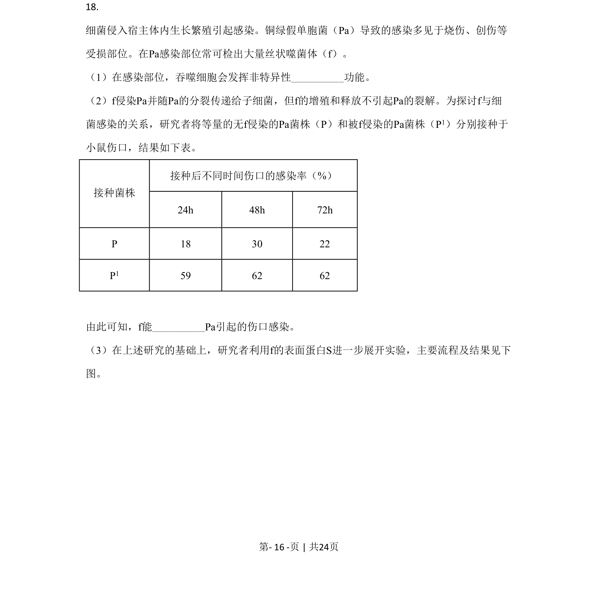
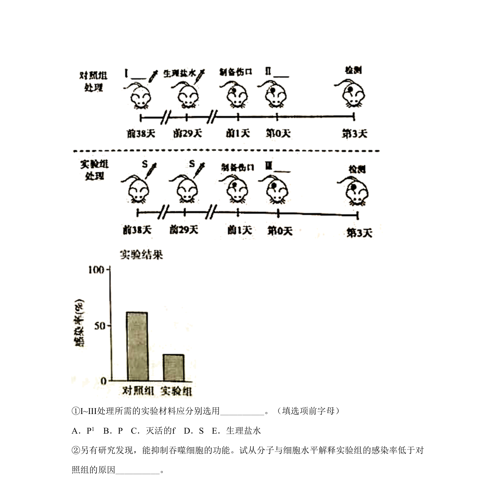
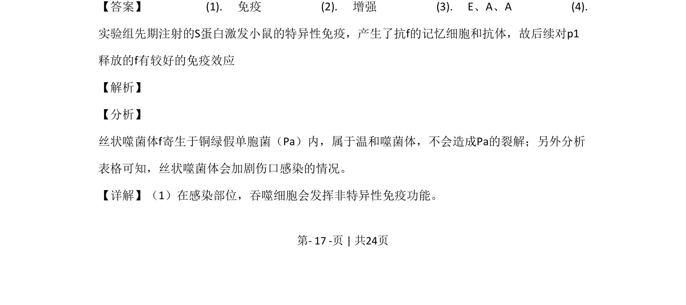
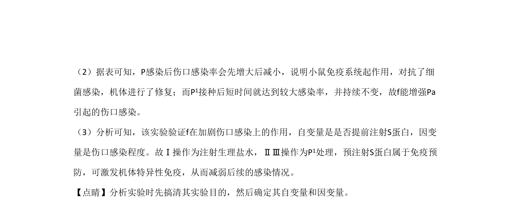

## 题面

## 摘要

考查免疫调节与实验分析、光合作用光反应及基因工程应用。

## 关联考点

- [[156-免疫|免疫]]
- [[811-变量控制|实验变量]]
- [[236-光反应|光反应]]
- [[411-基因工程|基因工程]]

## 答案与解析

> 📄 原 PDF 第 16 页：`素材/真题/北京/2008-2024·（北京）生物高考真题/2020年高考生物试卷（北京）（解析卷）.pdf`
