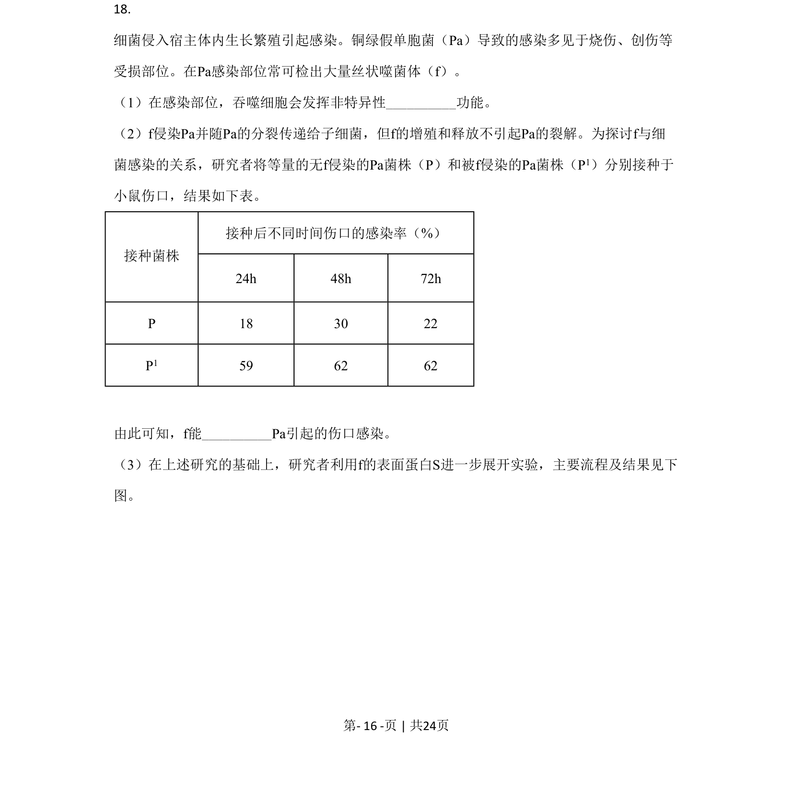
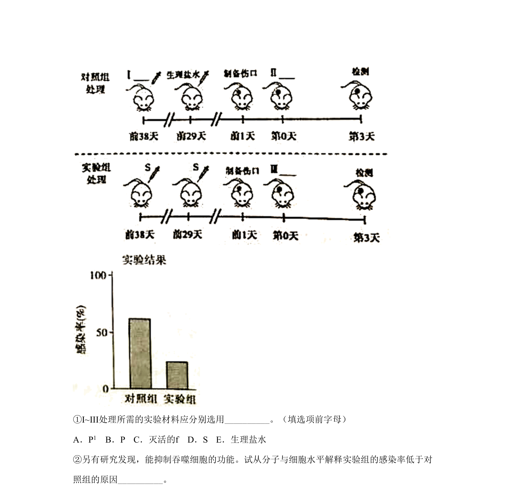
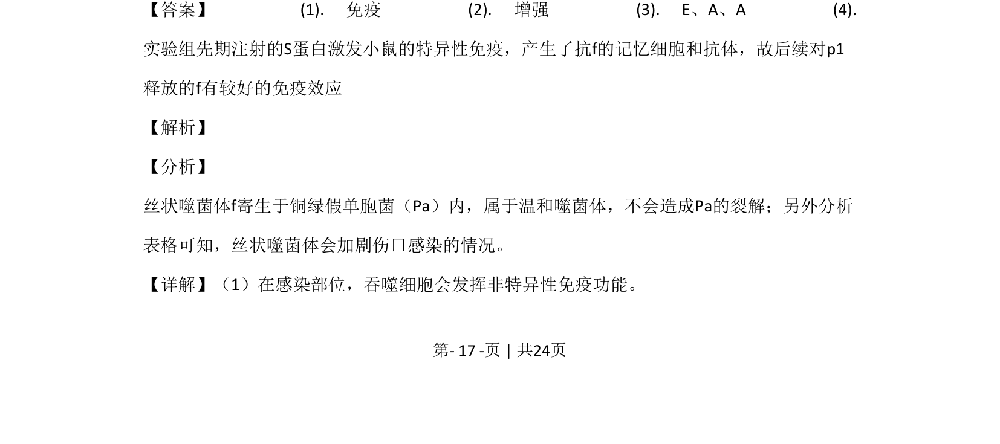
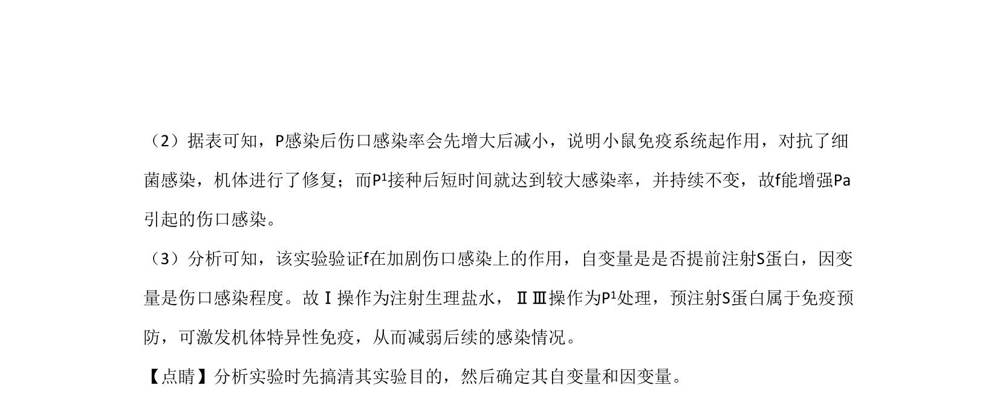

## 题面

## 摘要

考查免疫调节与实验分析、光合作用光反应及基因工程应用。

## 关联考点

- [[156-免疫|免疫]]
- [[811-变量控制|实验变量]]
- [[236-光反应|光反应]]
- [[411-基因工程|基因工程]]

## 答案与解析

> 📄 原 PDF 第 16 页：`素材/真题/北京/2008-2024·（北京）生物高考真题/2020年高考生物试卷（北京）（解析卷）.pdf`

<!-- 题干文本-start -->
## 题干文本
18. 
细菌侵入宿主体内生长繁殖引起感染。铜绿假单胞菌（Pa）导致的感染多见于烧伤、创伤等
受损部位。在Pa感染部位常可检出大量丝状噬菌体（f）。
（1）在感染部位，吞噬细胞会发挥非特异性__________功能。
（2）f侵染Pa并随Pa的分裂传递给子细菌，但f的增殖和释放不引起Pa的裂解。为探讨f与细
菌感染的关系，研究者将等量的无f侵染的Pa菌株（P）和被f侵染的Pa菌株（P1）分别接种于
小鼠伤口，结果如下表。
接种后不同时间伤口的感染率（%）
接种菌株
24h 48h 72h
P 18 30 22
P1 59 62 62
由此可知，f能__________Pa引起的伤口感染。
（3）在上述研究的基础上，研究者利用f的表面蛋白S进一步展开实验，主要流程及结果见下
图。
<!-- 题干文本-end -->

<!-- 解析文本-start -->
## 解析文本

<!-- 解析文本-end -->
