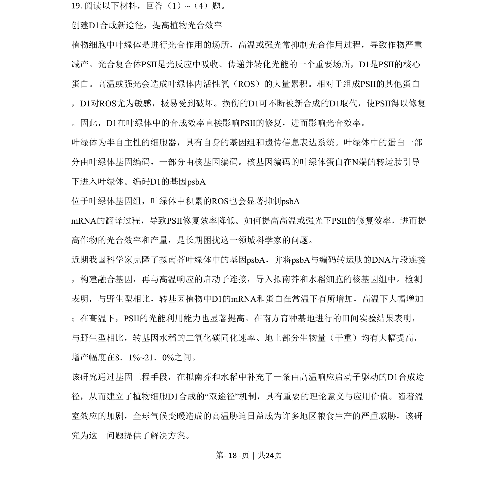
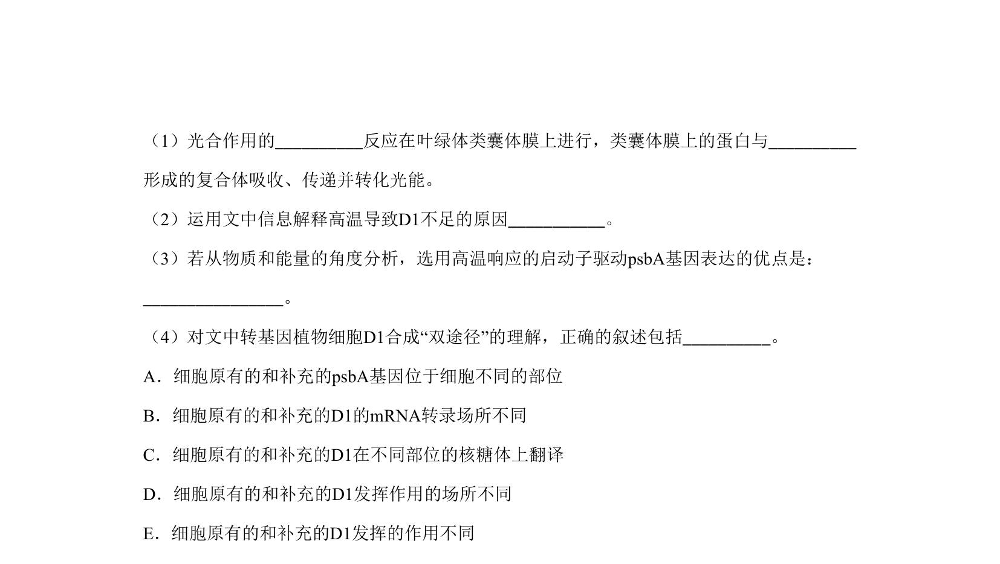
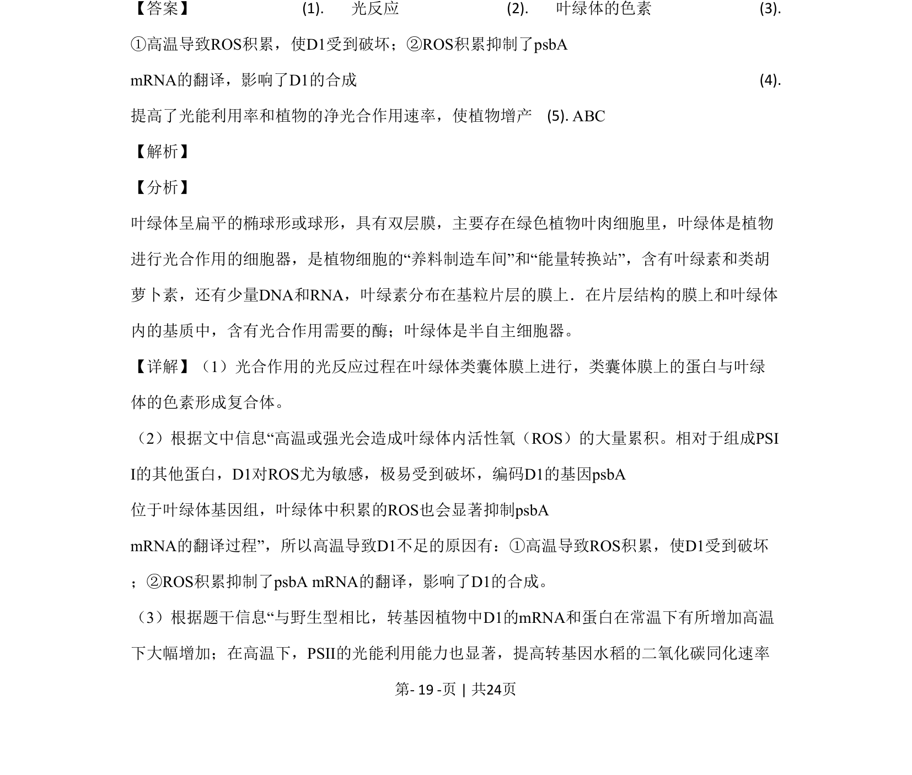
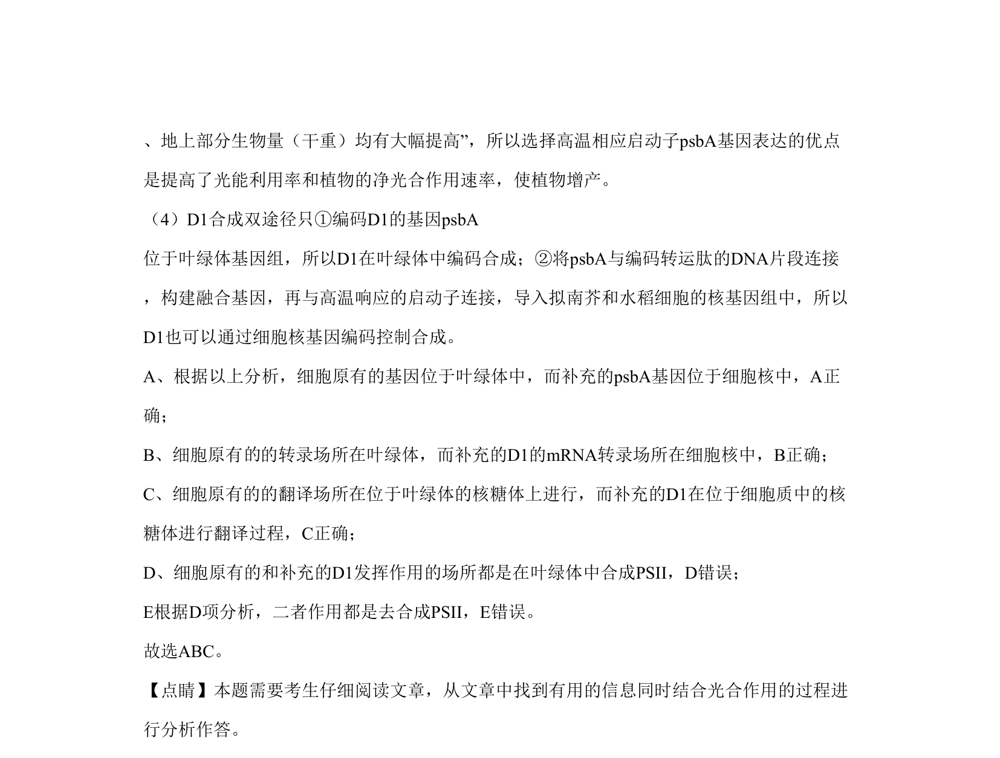

## 题面

## 摘要

该题考查叶绿体结构与光合作用光反应机制、D1蛋白合成调控及植物组织培养中激素诱导生芽的分子机制。

## 关联考点

- [[033-光合作用|光合作用]]
- [[047-叶绿体|叶绿体]]
- [[479-基因表达|基因表达]]
- [[437-植物组织培养|植物组织培养]]

## 答案与解析

> 📄 原 PDF 第 18 页：`素材/真题/北京/2008-2024·（北京）生物高考真题/2020年高考生物试卷（北京）（解析卷）.pdf`
