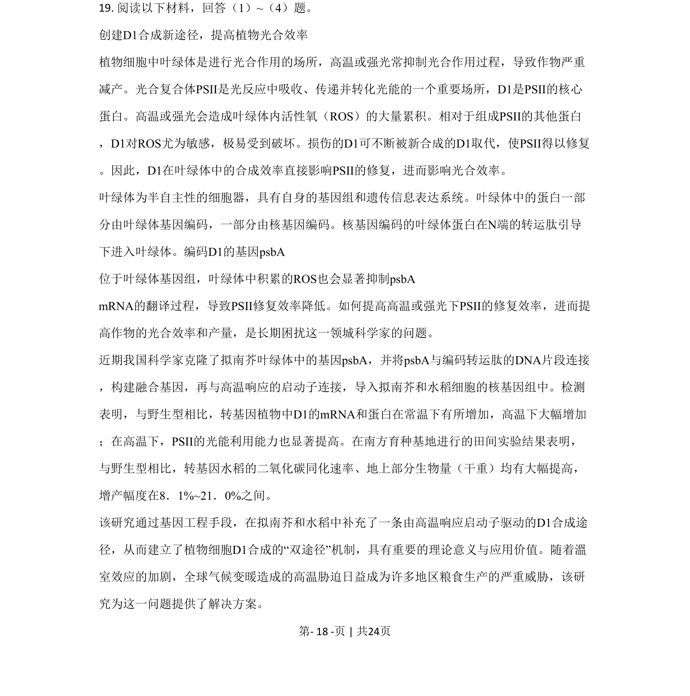
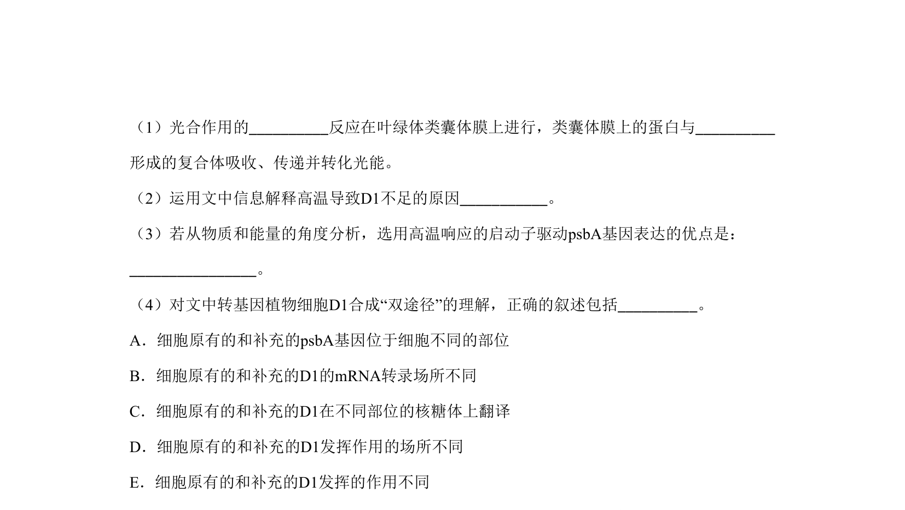
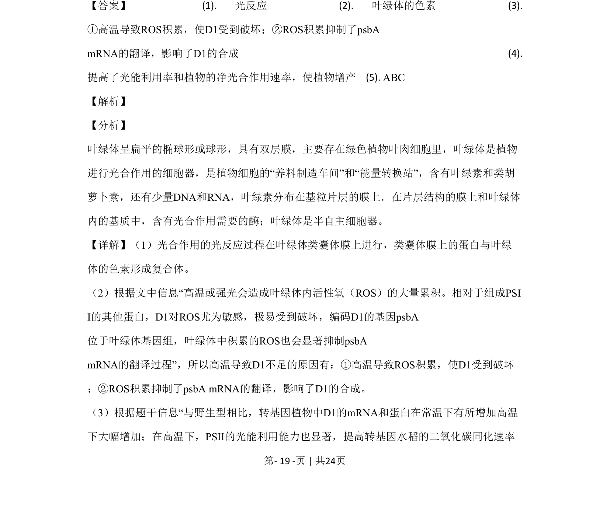
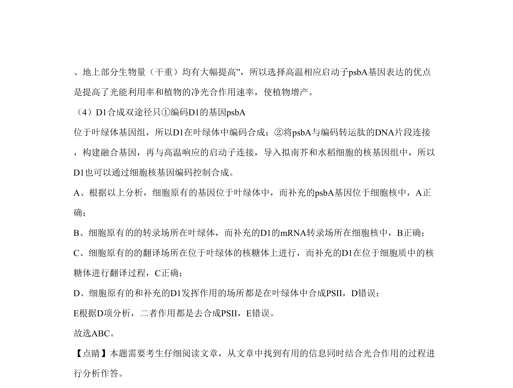

## 题面

## 摘要

该题考查叶绿体结构与光合作用光反应机制、D1蛋白合成调控及植物组织培养中激素诱导生芽的分子机制。

## 关联考点

- [[033-光合作用|光合作用]]
- [[047-叶绿体|叶绿体]]
- [[843-基因的表达|基因表达]]
- [[437-植物组织培养|植物组织培养]]

## 答案与解析

> 📄 原 PDF 第 18 页：`素材/真题/北京/2008-2024·（北京）生物高考真题/2020年高考生物试卷（北京）（解析卷）.pdf`

<!-- 题干文本-start -->
## 题干文本
19. 阅读以下材料，回答（1）~（4）题。
创建D1合成新途径，提高植物光合效率
植物细胞中叶绿体是进行光合作用的场所，高温或强光常抑制光合作用过程，导致作物严重
减产。光合复合体PSII是光反应中吸收、传递并转化光能的一个重要场所，D1是PSII的核心
蛋白。高温或强光会造成叶绿体内活性氧（ROS）的大量累积。相对于组成PSII的其他蛋白
，D1对ROS尤为敏感，极易受到破坏。损伤的D1可不断被新合成的D1取代，使PSII得以修复
。因此，D1在叶绿体中的合成效率直接影响PSII的修复，进而影响光合效率。
叶绿体为半自主性的细胞器，具有自身的基因组和遗传信息表达系统。叶绿体中的蛋白一部
分由叶绿体基因编码，一部分由核基因编码。核基因编码的叶绿体蛋白在N端的转运肽引导
下进入叶绿体。编码D1的基因psbA 
位于叶绿体基因组，叶绿体中积累的ROS也会显著抑制psbA 
mRNA的翻译过程，导致PSII修复效率降低。如何提高高温或强光下PSII的修复效率，进而提
高作物的光合效率和产量，是长期困扰这一领城科学家的问题。
近期我国科学家克隆了拟南芥叶绿体中的基因psbA，并将psbA与编码转运肽的DNA片段连接
，构建融合基因，再与高温响应的启动子连接，导入拟南芥和水稻细胞的核基因组中。检测
表明，与野生型相比，转基因植物中D1的mRNA和蛋白在常温下有所增加，高温下大幅增加
；在高温下，PSII的光能利用能力也显著提高。在南方育种基地进行的田间实验结果表明，
与野生型相比，转基因水稻的二氧化碳同化速率、地上部分生物量（干重）均有大幅提高，
增产幅度在8．1%~21．0%之间。
该研究通过基因工程手段，在拟南芥和水稻中补充了一条由高温响应启动子驱动的D1合成途
径，从而建立了植物细胞D1合成的“双途径”机制，具有重要的理论意义与应用价值。随着溫
室效应的加剧，全球气候变暖造成的高温胁迫日益成为许多地区粮食生产的严重威胁，该研
究为这一问题提供了解决方案。
<!-- 题干文本-end -->

<!-- 解析文本-start -->
## 解析文本

<!-- 解析文本-end -->
