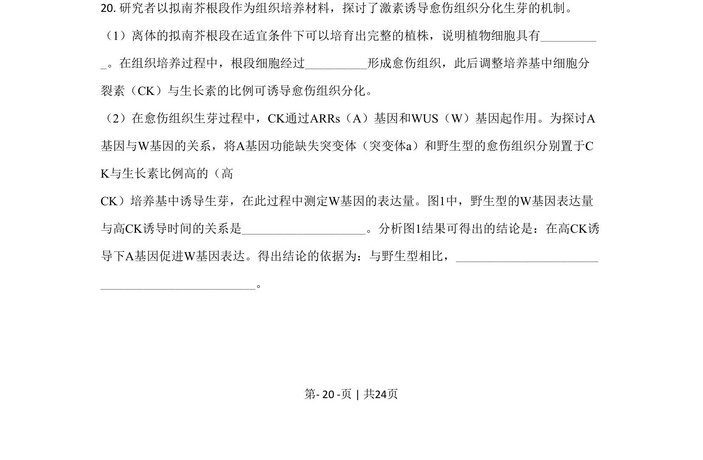
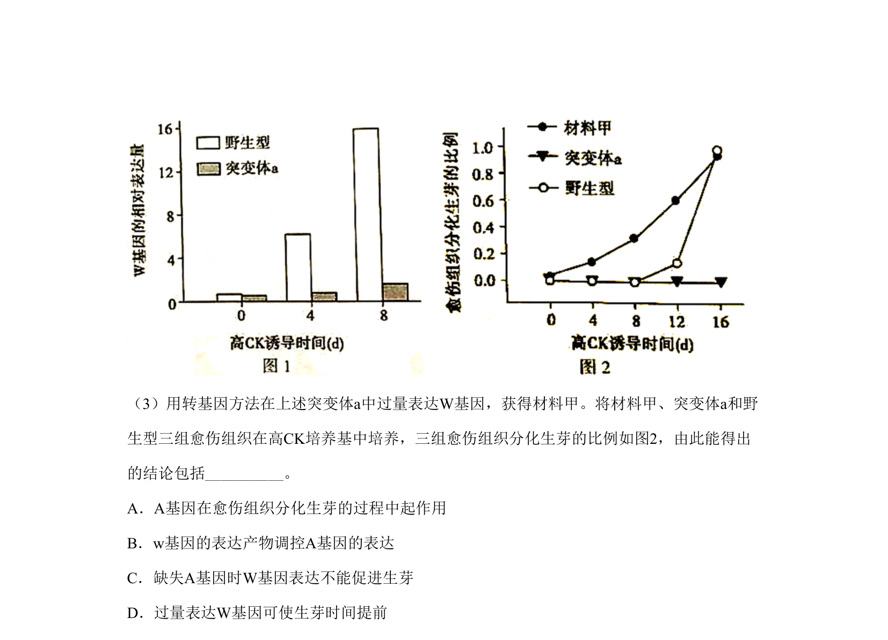
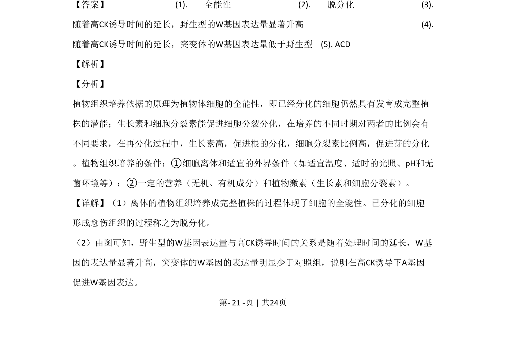
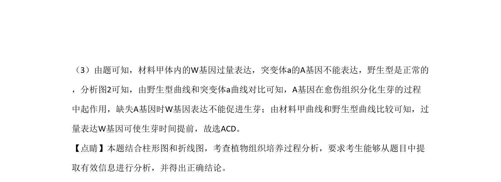

## 题面

## 摘要

（待补）

## 关联考点

## 答案与解析

> 📄 原 PDF 第 20 页：`素材/真题/北京/2008-2024·（北京）生物高考真题/2020年高考生物试卷（北京）（解析卷）.pdf`

<!-- 题干文本-start -->
## 题干文本
20. 研究者以拟南芥根段作为组织培养材料，探讨了激素诱导愈伤组织分化生芽的机制。
（1）离体的拟南芥根段在适宜条件下可以培育出完整的植株，说明植物细胞具有_________
_。在组织培养过程中，根段细胞经过__________形成愈伤组织，此后调整培养基中细胞分
裂素（CK）与生长素的比例可诱导愈伤组织分化。
（2）在愈伤组织生芽过程中，CK通过ARRs（A）基因和WUS（W）基因起作用。为探讨A
基因与W基因的关系，将A基因功能缺失突变体（突变体a）和野生型的愈伤组织分别置于C
K与生长素比例高的（高 
CK）培养基中诱导生芽，在此过程中测定W基因的表达量。图1中，野生型的W基因表达量
与高CK诱导时间的关系是____________________。分析图1结果可得出的结论是：在高CK诱
导下A基因促进W基因表达。得出结论的依据为：与野生型相比，_______________________
_________________________。
的
<!-- 题干文本-end -->

<!-- 解析文本-start -->
## 解析文本

<!-- 解析文本-end -->
