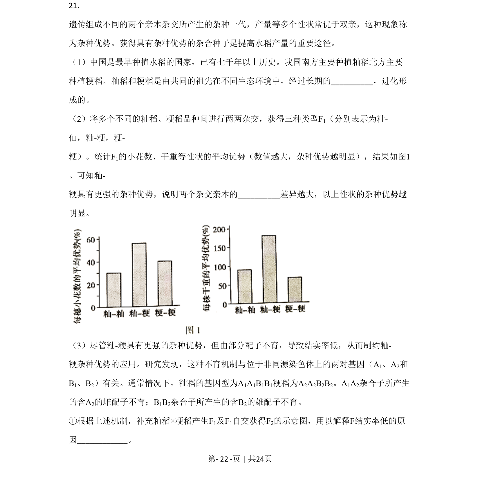
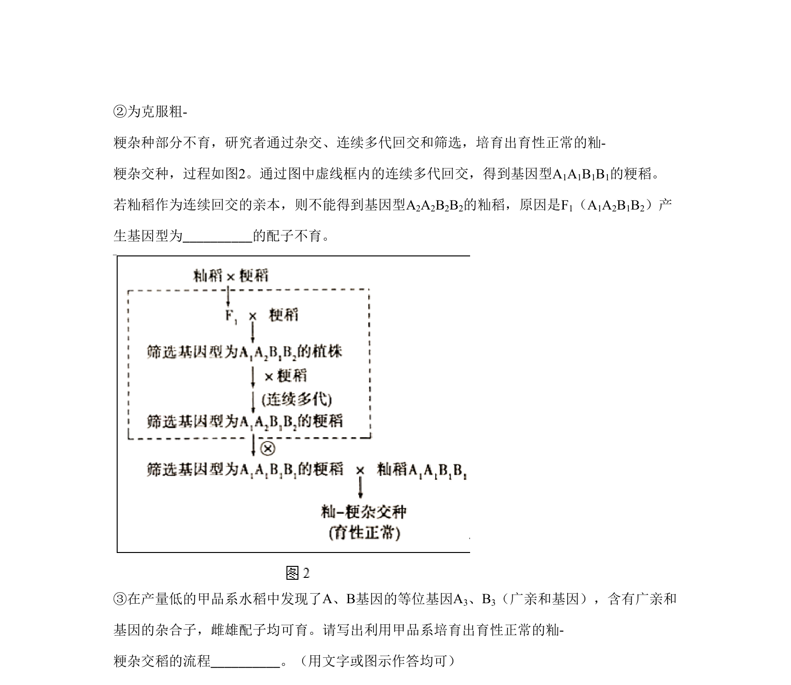
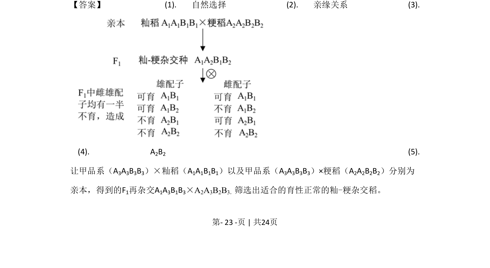
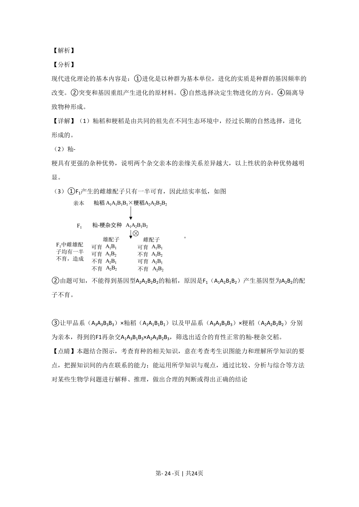

## 题面

## 摘要

本题结合籼稻和粳稻杂交，考查现代进化理论、杂种优势及配子不育原理在育种中的应用。

## 关联考点

- [[现代进化理论]]
- [[803-基因频率|基因频率]]
- [[892-杂种优势|杂种优势]]
- [[配子不育]]

## 答案与解析

> 📄 原 PDF 第 22 页：`素材/真题/北京/2008-2024·（北京）生物高考真题/2020年高考生物试卷（北京）（解析卷）.pdf`
